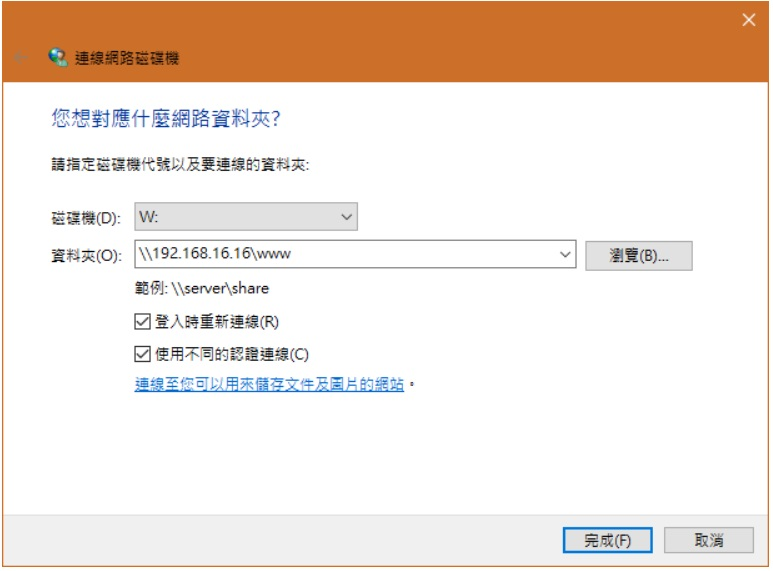

## Applications:
<br>openssh-server
<br>samba-server
<br>screen, .screenrc
<br>vim, .vimrc, vim color: minimalist.vim
<br>docker
<br>gitbook

## SSH Server
### Setting Static IP
+ Showing route info:

```text
route -n
Destination     Gateway         Genmask         Flags Metric Ref    Use Iface
0.0.0.0         192.168.131.2   0.0.0.0         UG    100    0        0 ens33
169.254.0.0     0.0.0.0         255.255.0.0     U     1000   0        0 ens33
172.17.0.0      0.0.0.0         255.255.0.0     U     0      0        0 docker0
192.168.131.0   0.0.0.0         255.255.255.0   U     100    0        0 ens33
```

+  sudo vi /etc/network/interfaces(set vmwarw ip as static)

```text
# interfaces(5) file used by ifup(8) and ifdown(8)
auto lo
iface lo inet loopback

#add as below:
auto ens33
iface ens33 inet static
address 192.168.131.128
gateway 192.168.131.2
netmask 255.255.255.0
dns-nameservers 8.8.8.8 8.8.4.4
```
+ Restart Networking Service

```bash
sudo /etc/init.d/networking restart
#or systemctl restart networking
```

+ Reboot Ubuntu

```bash
sudo reboot
#or shutdown -r now
```
[ref. link native; ](https://michael.mckinnon.id.au/2016/05/05/configuring-ubuntu-16-04-static-ip-address/)
[ref. link](https://itw01.com/Y2ANE93.html)

### Open SSH Server
+ Installation and Setting
<br> 剛灌好系統先讓系統可以SSH
```bash
sudo apt install openssh-server
```
重新啟動
```bash
sudo systemctl restart sshd.service
sudo systemctl restart sshd
```
[Reference](http://hsu.logdown.com/posts/2016/05/19/ubuntu-server-1604-lts-notes)

## Samba Server
### Samba Server Setting on Ubuntu
Installation
```bash
sudo apt-get install samba
```
Add a samba user
```bash
sudo adduser smbuser #smbusr can be anyone, Smith
```
Add a samba user password
```bash
sudo smbpasswd -a smbuser
```
Setting samba configuration **/etc/samba/smb.conf** 檔案，然後，在檔案的尾巴加入下面這幾行後存檔離開。
```text
[public]              #"public" 名稱可以自行變更
path = /home/smbuser  #這個是要分享的資料夾路徑
available = yes
valid users = smbuser #這個是可以使用這個分享資料夾的使用者，要具有 path 所指定的路徑的權限才行
read only = no
browseable = yes
public = yes
writable = yes
```
Restart Samba serve
```bash
sudo service smbd restart
```
+ **Other Samba Configuration**
<!--- limiation line
<br>---------------20------------------40-----------------60------------------80--------------
-->
**/etc/samba/smb.conf**:
<br>首先先找到設定檔裡面的 **workgroup**, 大約在29行附近，把 workgroup設成和Windows 系統的一樣
<br>(可以到控制台\系統及安全性\系統查看)。 Change this to the workgroup/NT-domain name your
<br>Samba server will part of,  **workgroup = NOOBTW**有關安全性問題，預設 Samba 會使用 Linux
<br>帳號的密碼, 一般來說會建議保持原設定即可；如果要關掉 Samba 的認證，可以在裡面加上:
<br>**security = share** 上面大概是 Samba 的一些基本測試，重頭戲在下面, 如何設定要分享的資料夾?
<br>首先我們以**www**資料夾為例，直接將這段放在**smb.conf**的最下面即可：
```text
[www]
comment = www
path = /var/www
browseable = yes
read only = no
create mask = 777
directory mask = 777
```
<!--- limiation line
<br>---------------20------------------40-----------------60------------------80--------------
-->
[www] 指的是要分享的資料夾的名稱，comment 則是描述，path 是 Linux 資料夾的路徑，browseable
<br>是可否瀏覽，read only 是是否唯讀，剩下兩個 mask 則是檔案預設的權限。最後請離開 smb.conf,我
<br>們要設定可以使用 Samba 的用戶。

### Samba Client Setting on Windows
As Below:  <br>


**Refer as:**
[samba setting on Ubuntu](https://www.arthurtoday.com/2015/04/ubuntu-server-share-folder-samba.html) and [samba directory on Windows](https://noob.tw/samba/)

## VIM
### Installation
```bash
sudo apt-get install vim
```
### [\.vimrc Instance](https://github.com/smitha1672/note/blob/master/rc/.vimrc)
### Operation
```text
# Import .vimrc setting
:so ~/.vimrc
```
```text
# Show binary file
:%!xxd
```
```text
# Copy more lines in register, and then paste to a place
1. ctrl + V - It is for a section would be like to copy.
2. shift + " + ay - "ay" copies the section in register
3. shift + " + ap - "ap" pastes the section to your destnation place

e/E - 將cursor移到字尾.
b/E - 將cursor移到字首
( - 將cursor移到上一句子開頭
) - 將cursor移到下一句子開頭
{ - 將cursor移到上一個段落開頭
} - 將cursor移到下一個段落開頭
I - 將文字插入到cursor position
D/ d$ - After cursor position, End of content is deleted on one line.
d0 - Before cursor position, Start of content is deleted on one line.
U - 取消自上次移動到目前行以來所做的所有操作
. - 將操作重覆執行 (輸入O > 打字 > 輸入.)
M - 將cursor移到screen 的中間行.
L - 將cursor移到screen 的最底行.
```

```text
# Replace from string.a to string.b
:[range]s/string.a/string.b/gc #[range] is able be [line.start, line.end]

# 每行的行首都添加一个字符串
:%s/^/要插入的字符串

#每行的行尾都添加一个字符串
:%s/$/要插入的字符串

# 替換以word開始的單字.
:%s/\<buf/stat_buf/g

# 寫新檔名
:w test.c
```

```text
# 開啟該程式中的所有原始檔, 並且將顯示位置停留在 main fucntion
vi +/main *.h *.c
```

[vim buffers and windows](https://www.openfoundry.org/tw/tech-column/2383-vim--buffers-and-windows)
```text
# Is showes as below
:ls

:buffers (:ls or :files)
1 %a   "file1"                        line 1
2      "file2"                        line 0
3      "file3"                        line 0

# Jump to particular file
:[N]buffer

For instance
:2buffer or :buffer 2

# Add a file to buffer
:badd path/to/file4
```

vim grep

```text
[ref](https://blog.easwy.com/archives/advanced-vim-skills-quickfix-mode/)
As follows:
:vim[grep][!] /{pattern}/[g][j] {file} ..
Recursive search:
:vimgrep /dostuff()/j ../**/*.c

Dotfiles:
:vimgrep /pattern/ ./.*
:cw
:copen
These commands all fill a list with the results of their search.
"grep" and "vimgrep" fill the "quickfix list",
which can be opened with :cw or :copen

ref.: https://blog.csdn.net/zqiang_55/article/details/30715961
vimgrep /匹配模式/[g][j] 要搜索的文件/范围
g：表示是否把每一行的多个匹配结果都加入
j：表示是否搜索完后定位到第一个匹配位置

vimgrep /pattern/ %           在当前打开文件中查找
vimgrep /pattern/ *           在当前目录下查找所有
vimgrep /pattern/ **          在当前目录及子目录下查找所有
vimgrep /pattern/ *.c         查找当前目录下所有.c文件
vimgrep /pattern/ **/*        只查找子目录

cn                            查找下一个
cp                            查找上一个
copen                         打开quickfix
cw                            打开quickfix
cclose                        关闭qucikfix
help vimgrep                  查看vimgrep帮助

ref.: https://blog.csdn.net/icbm/article/details/71036168
files 参数举例：
% 表示在当前缓冲区文件中查找。

*.cpp 表示在当前目录中的 .cpp 文件中搜索。

**/*.cpp 表示在当前目录及子目录中 .cpp 文件中搜索。

**/*.cpp **/*.h 表示在当前目录及子目录中 .cpp、.h 文件中搜索。
```

open a few files to vim buffers
```bash
vim file1 file2 file3
```

## Screen
### [Installation](https://blog.gtwang.org/linux/screen-command-examples-to-manage-linux-terminals/)
```bash
sudo apt-get install screen
```
### [\.screensrc instance](https://github.com/smitha1672/note/blob/master/rc/.screenrc)
### Operation
```text
F7 -  to detach screen session (to background)
F8 -  to kill current screen window
F9 -  to create a new screen
ALT+S -  make a separate  window
ALT+f -  swith separate window
ALT+q - leave a separate window
```

## Docker
Refer as:
[Ubuntu Docker Install](https://blog.gtwang.org/virtualization/ubuntu-linux-install-docker-tutorial/), [Learn Docker](https://blog.gtwang.org/virtualization/ubuntu-linux-install-docker-tutorial/) and [Docker Command Line](https://docs.docker.com/engine/reference/commandline/docker/)

### Installation
Install
```bash
sudo apt-get install docker.io
```
Serve Checking
```bash
service docker status
```
Add my account to docker group
```bash
sudo usermod -aG docker smith
```
Checking Verion
```bash
docker version
```

### Pull ubuntu 16.04 or latest
```bash
docker pull ubuntu:16.04 #or ubuntu:latest
```

List images
```bash
docker images
```
```text
REPOSITORY          TAG                 IMAGE ID            CREATED             SIZE
ubuntu              16.04               e13f3d529b1a        4 days ago          115 MB
```

### Export/Import a container
List contains
```text
$ sudo docker ps -a
CONTAINER ID        IMAGE               COMMAND             CREATED             STATUS                    PORTS               NAMES
7691a814370e        ubuntu:14.04        "/bin/bash"         36 hours ago        Exited (0) 21 hours ago                       test
```
export the container
```bash
sudo docker export 7691a814370e > ubuntu.tar #ubuntu.tar is a example
```
import a image file to image
```bash
 docker import ubuntu.tar unbuntu16.04:v1.0 # ubuntu.tar unbuntu16.04:v1.0 is a example
```

Run a image
```bash
sudo docker run -itv /home/smith/workspace/project:/home/mt2523 ubuntu/14.04:linkit_gfx bash
# /home/smith/workspace/project meaning is local directory.
# /home/mt2523 meaning is container directory
# -v: if local directory doest not exist, "-v" is able to remove
```

## Gitbook
You have to install **Node.js**, **npm**, **tbook servegitbook**
[GitBool Toolchain Documentation; ](https://toolchain.gitbook.com/examples.html)
[how to install node.js on ubuntu 16.04:Native](https://www.digitalocean.com/community/tutorials/how-to-install-node-js-on-ubuntu-16-04)

### Node.js, npm Installation
```bash
sudo apt-get update
sudo apt-get install nodejs
sudo apt-get install npm
sudo npm install gitbook-cli -g
```
### Preview with Firfox
```bash
gitbook init ./directory
cd ./directory
gitbook build
gitbook serve
```
There are available message
```text
Live reload server started on port: 35729
Press CTRL+C to quit ...

info: 7 plugins are installed
info: loading plugin "livereload"... OK
info: loading plugin "highlight"... OK
info: loading plugin "search"... OK
info: loading plugin "lunr"... OK
info: loading plugin "sharing"... OK
info: loading plugin "fontsettings"... OK
info: loading plugin "theme-default"... OK
info: found 7 pages
info: found 2 asset files
info: >> generation finished with success in 1.9s !

Starting server ...
Serving book on http://localhost:4000
```
#### Trouble Shooting
Executing `gitbook init`, I got error message as
```text
/usr/bin/env: ‘node’: No such file or directory
[fix] ln -s /usr/bin/nodejs /usr/bin/node
```

## Usefual Ubuntu Command
### apt-get update
```bash
sudo apt-get update
sudo apt-get -y dist-upgrade
sudo apt-get clean
sudo apt-get autoremove
```
### apt-get remove
Remove **texlive-full**
```bash
sudo apt-get remove texlive-full
```
但由於先前安裝此套件，會一併自動安裝相依套（dependencies),
所以需要再用**autoremove**清理。

```bash
sudo apt-get autoremove #or
sudo apt-get remove --auto-remove
```
但是這樣還不夠乾淨，因為預設的 remove 行為，會保留一些設定檔之類的遺物。
所以需要用 purge 的方式移除。針對單一套件使用 purge 方式徹底移除：
```bash
sudo apt-get purge texlive-full #or
sudo apt-get remove --purge texlive-full
```
[ref.](http://blog.lyhdev.com/2013/01/ubuntu-linux-apt-get.html)

### ssh client
+ How to link SSH server to from a ubuntu system to the other ubuntu system

```bash
ssh smith@192.168.131.128
```

## windows + Ubuntu 安裝
[ref.1 link](https://www.xmind.net/m/J5mt/)
<br> [ref.2 link](https://read01.com/jND7m.html#.W1wvzdIzaUk)

## Ubuntu Trouble Shooting
### sudo must be owned by uid 0 and have the setuid bit set
You shouldn’t have a /usr/local/bin/sudo,
that’s what’s breaking things (not the password change). Move it out of the way:
```bash
/usr/bin/sudo mv /usr/local/bin/sudo{,2}
```
and then tell your shell about it:
```bash
hash -r
```
That will restore the sudo functionality you’re used to. shareimprove this answer

### Screen needs mode 777 with systemd service
The directory needs full permissions to read, write, and execute.
You can do this command
```bash
chmod -R 777 /var/run/screen
```
Which will **recursively** change all folders/files permissions to 777,
though typically less secure.
You can also run sudo
```bash
chown -R $USER:$USER /var/run/screen
```
This will allow a typical user/or group full access, and will be more secure
