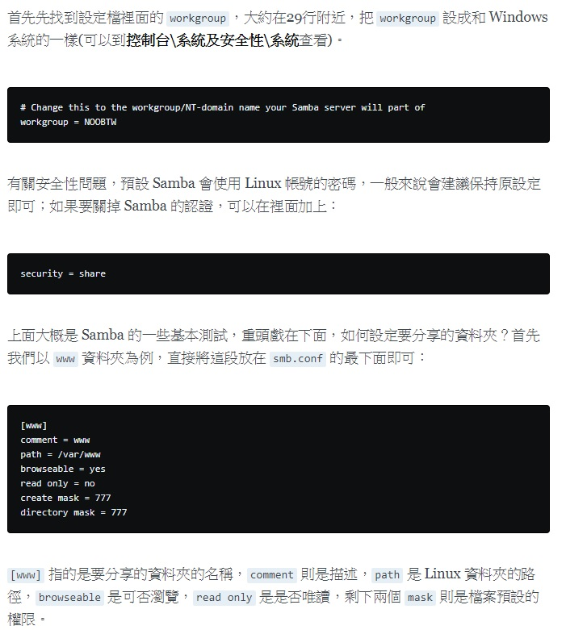

## VIM
### operation
+ **:so ~/.vimrc**: Import vimrc setting
+ **:%!xxd**: show binary file
+ copy more lines in register, and then paste to a place
  example:
  1. **V** is for a section would be like to copy.
  2. **"kyy** copy the section in register
  3. **"kp"** paste the section to your destnation place
+ **:line_number,$s/string.a/string.b/gc**" Replace from string.a to string.b

### [vim buffers and windows](https://www.openfoundry.org/tw/tech-column/2383-vim--buffers-and-windows)
open a few files to vim buffers
```bash
$vim file1 file2 file3
```
**:ls** - it show as below
```text
:buffers (:ls or :files)
1 %a   "file1"                        line 1
2      "file2"                        line 0
3      "file3"                        line 0
```
**:[N]buffer** - Jump to particular file
```text
:2buffer or :buffer 2
```
**:badd** - Add a file to buffer
```text
:badd path/to/file4
```
## Screen
TODO

## Docker
Refer as:
[Ubuntu Docker Install](https://blog.gtwang.org/virtualization/ubuntu-linux-install-docker-tutorial/), [Learn Docker](https://blog.gtwang.org/virtualization/ubuntu-linux-install-docker-tutorial/) and [Docker Command Line](https://docs.docker.com/engine/reference/commandline/docker/)

+ **Docker Install**
> Install
```bash
sudo apt-get install docker.io
```
> Serve Checking
```bash
service docker status
```
> Add my account to docker group
```bash
sudo usermod -aG docker smith
```
> Checking Verion
```bash
docker version
```

+ Docker pull **ubuntu 16.04 or latest**
```bash
docker pull ubuntu:16.04 #or ubuntu:latest
```

+ List images
```bash
docker images
```
```text
REPOSITORY          TAG                 IMAGE ID            CREATED             SIZE
ubuntu              16.04               e13f3d529b1a        4 days ago          115 MB
```

+ Export/Import a container
> List contains
```text
$ sudo docker ps -a
CONTAINER ID        IMAGE               COMMAND             CREATED             STATUS                    PORTS               NAMES
7691a814370e        ubuntu:14.04        "/bin/bash"         36 hours ago        Exited (0) 21 hours ago                       test
```
> export the container
```bash
sudo docker export 7691a814370e > ubuntu.tar #ubuntu.tar is a example
```
> import a image file to image
```bash
 docker import ubuntu.tar unbuntu16.04:v1.0 # ubuntu.tar unbuntu16.04:v1.0 is a example
```

+ Run a image
```bash
sudo docker run -itv /home/smith/workspace/project:/home/mt2523 ubuntu/14.04:linkit_gfx bash
# /home/smith/workspace/project meaning is local directory.
# /home/mt2523 meaning is container directory
# -v: if local directory doest not exist, "-v" is able to remove
```

## Gitbook
You have to install **Node.js**, **npm**, **gitbook**
+ 2 reference URLs:
[how to install node.js on ubuntu 16.04:Native](https://www.digitalocean.com/community/tutorials/how-to-install-node-js-on-ubuntu-16-04)
[git-book-start](http://samwhelp.github.io/blog/read/platform/gitbook/start/)

If you want a **pdf** file, you have to install **calibre**
How to edit [Markdown](https://markdown.tw/#em)
Preview your [MD file](https://stackedit.io/app#)

## Samba
Refer as:
[samba setting on Ubuntu](https://www.arthurtoday.com/2015/04/ubuntu-server-share-folder-samba.html) and [samba directory on Windows](https://noob.tw/samba/)

+ **Samba setting on Ubuntu**
> Install
```bash
sudo apt-get install samba
```
> Add a samba user
```bash
sudo adduser smbuser --shell /bin/false #smbusr can be anyone, Smith
```
> Add a samba user password
```bash
sudo smbpasswd -a 123456
```
> Setting samba configuration **/etc/samba/smb.conf** 檔案，然後，在檔案的尾巴加入下面這幾行後存檔離開。
```bash
[public]              #"public" 名稱可以自行變更
path = /home/smbuser  #這個是要分享的資料夾路徑
available = yes
valid users = smbuser #這個是可以使用這個分享資料夾的使用者，要具有 path 所指定的路徑的權限才行
read only = no
browseable = yes
public = yes
writable = yes
```
> Restart Samba serve
```bash
sudo service smbd restart
```
+ *Other Samba Configuration*


**TODO**

## Ubuntu Update
```bash
sudo apt-get update
sudo apt-get -y dist-upgrade
sudo apt-get clean
sudo apt-get autoremove
```

## Ubuntu Uninstall
Remove **texlive-full**
```bash
sudo apt-get remove texlive-full
```
但由於先前安裝此套件，會一併自動安裝相依套（dependencies),
所以需要再用**autoremove**清理。

```bash
sudo apt-get autoremove #or
sudo apt-get remove --auto-remove
```
但是這樣還不夠乾淨，因為預設的 remove 行為，會保留一些設定檔之類的遺物。
所以需要用 purge 的方式移除。針對單一套件使用 purge 方式徹底移除：
```bash
sudo apt-get purge texlive-full #or
sudo apt-get remove --purge texlive-full
```
[ref.](http://blog.lyhdev.com/2013/01/ubuntu-linux-apt-get.html)

## Trouble Shooting
**sudo must be owned by uid 0 and have the setuid bit set**  <br>
You shouldn’t have a /usr/local/bin/sudo,
that’s what’s breaking things (not the password change). Move it out of the way:
```bash
/usr/bin/sudo mv /usr/local/bin/sudo{,2}
```
and then tell your shell about it:
```bash
hash -r
```
That will restore the sudo functionality you’re used to. shareimprove this answer

**Screen needs mode 777 with systemd service**  <br>
The directory needs full permissions to read, write, and execute.
You can do this command
```bash
chmod -R 777 /var/run/screen
```
Which will **recursively** change all folders/files permissions to 777,
though typically less secure.
You can also run sudo
```bash
chown -R $USER:$USER /var/run/screen
```
This will allow a typical user/or group full access, and will be more secure

####

####


