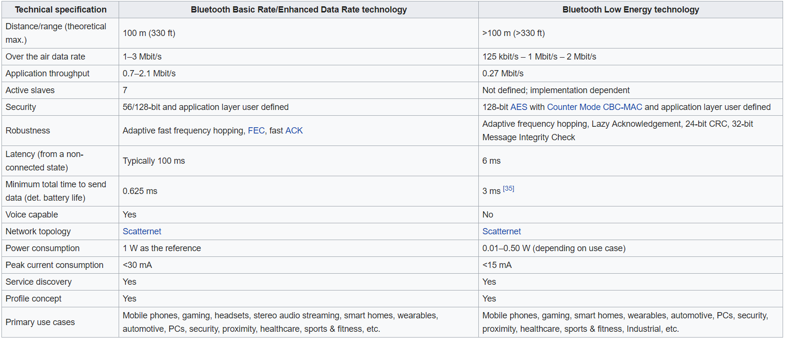
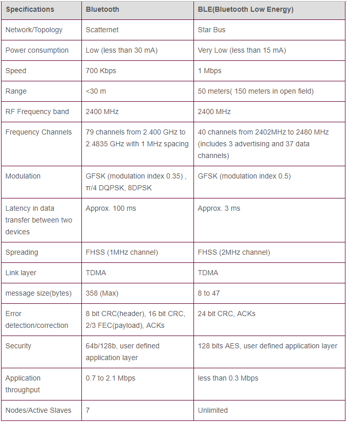

#

## Bluetooth Basic v.s Bluetooth Low Engergy

## Blooth Low Engery

[ble-microchip](http://microchipdeveloper.com/wireless:ble-phy-layer)

### The BLE protocol stack

### Physical Layer-Controller

+ Frequency Bands

The radio uses the 2.4 GHz ISM (Industrial, Scientific, and Medical) band to communicate and divides
this band into 40 channels on 2 MHz spacing from 2.4000 GHz to 2.4835 GHz, starting at 2402 MHz:

+ Channel Arrangement

The 40 channels are divided into 3 Advertising Channels (Ch. 37, 38, 39),
and 37 Data Channels (Ch.0-36).

> Advertising Channel Usage
  1. Device Discovery
  2. Connection Establishment
  3. Broadcast Transmissions

> Data Channel Usage
  1. Bidirectional communication between connected devices
  2. Adaptive frequency hopping used for subsequent connection events

+ Modulation & Data Rate

When transmitting data, the BLE radio transmits at `1 Mbps`, with `1 bit per symbol`. The radio is
optimized for sending small chunks of data quickly.

The BLE radio uses Gaussian frequency-shift keying (GFSK), whereby the data pulses are filtered with
a Gaussian filter before being applied to alter the carrier frequency, in order to make the
frequency transitions smoother.

Note: BLE protocol overhead limits overall data throughput to significantly less than 1 Mbps.

### Link Layer-Controller
To do this, it is primarily concerned with channels, packets, discovery, and connection procedures.

#### Channels

> Advertising Channel Usage
  1. Device Discovery
  2. Connection Establishment
  3. Broadcast Transmissions

> Data Channel Usage
  1. Bidirectional communication between connected devices
  2. Adaptive frequency hopping used for subsequent connection events

#### Roles and States

Link Layer perspective, the following role pairs are defined `Advertiser/Scanner (Initiator)`,
`Slave/Master`, `Broadcaster/Observer`

+ Unicast (Peer-Peer) Connection

 

 

`unicast.1`, diagram depicts two BLE hosts, initially in a Standby (unconnected) state. They enter
a Discovery state whereby the `device` wishing to be discovered becomes the `Advertiser` and the host
wishing to connect becomes a `Scanner`. The Advertiser sends advertising packets containing basic
information about the host. All Scanners receive these packets.

`unicast.2`, at some point, the Scanner (after filtering/analyzing information contained in the advertising
packets) becomes an Initiator and decides to initiate a connection with a specific advertiser. This
is known as the Connecting phase and is highlighted by the Initiator sending a `CONNECT_REQ`
advertising packet to the Advertiser

`unicast.3`, finally, the Advertiser accepts the connection request, thus becoming the Slave while
the Initiator becomes the Master. This is known as the Connected phase

#### Device Address

Bluetooth Device Address. This `48-bit (6-byte)` number `uniquely` identifies a device among peers.
There are two types of device addresses and one or both can be set on a device.

Each discovery/connection procedure must be performed using one of the two types and is specified by
the host

#### Packet Types

Link Layer has only `one packet format` used for both `advertising channel` packets and `data
channel`

> PUD: BLE packet Protocol Data Unit size in specification v4.0 and v4.1 is 2-39 bytes.

#### Discovery(Advertising & Scanning)

todo

#### Connections

todo

#### Security

todo

### Generic Access Profile(GAP)-Host

The Generic Access Profile (GAP) modes and procedures form the cornerstone for Bluetooth Low Energy
(BLE) `control-plane` operations:
+ Discover and connect with peers
+ Broadcast data
+ Establish secure connections

GAP defines these and other fundamental operations in a standard, universally understood manner.
It's important to understand GAP, since most BLE implementations provide GAP APIs for applications
wishing to use this functionality.

#### Bluetooth Low Energy GAP Roles

Bluetooth Low Energy (BLE) `devices` can operate in `one or more Generic Access Profile (GAP)` roles at
the same time (provided the Link Layer supports this):
> 1. Broadcaster
> 2. Observer
> 3. Peripheral
> 4. Central

The role imposes restrictions and enforces behavior, so it is generally fixed in the design stage of
the device.

Two role pairs are defined, allowing devices to communicate with each other.

+ Broadcaster/Observer

This role pair implements unidirectional, connection-less communications.

+ Broadcaster

> 1. Periodically sends advertising packets with data
> 2. Uses the Link Layer Advertiser role

+ Observer

> 1. Scans for broadcasters, listening for advertising data
> 2. Uses the Link Layer Scanner role

+ Network Topology

+ Peripheral/Central

This role pair implements bidirectional, connection-oriented communications.

+ Peripheral

> 1. Link Layer Slave role
> 2. Advertises by using connectable advertising packets
> 3. Optimized to consume the least amount of processing power and memory; Enables a low-cost design

+ Central

> 1. Link Layer Master role
> 2. Capable of establishing and managing a connection
> 3. May be connected to various devices simultaneously

+ Network Topology

#### Bluetooth Low Energy GAP Modes and Procedures
todo

#### Bluetooth Low Energy Security Modes and Procedures
todo

### Generic Attribute Profile (GATT)-Host

The Generic Attribute Profile (GATT) establishes `how data will be organized and exchanged` over a
Bluetooth Low Energy (BLE) connection.

Certain use-case-specific profiles (GATT-Based Profiles) are standardized by the Bluetooth Special
Interest Group (SIG):
+ Heart Rate Profile
+ Proximity Profile
+ etc.

For a GATT example, the following depicts a GATT Server having two services (one Public, one Private), with a GATT
Client executing several GATT operations to read/write the data (characteristics) in those services.

#### Universally Unique Identifier (UUID)

A universally unique identifier (UUID) is a globally `unique 128-bit (16-byte)` number that is used to
identify Profiles, Services and Data Types in a Generic Attribute (GATT) Profile.

For efficiency, the Bluetooth Low Energy (BLE) specification adds support for `shortened 16-bit`
UUIDs. These shortened formats can `only be used` with `Bluetooth SIG defined GATT profiles`.

All UUIDs in BLE are 128-bits (i.e. a 16-bit SIG-approved UUID is actually just part of a 128 bit
UUID. For example, the Client Configuration Descriptor UUID (2902) is actually
00002902-0000-1000-8000–00805f9b34fb).

Therefore, these shortened formats can only be used with UUIDs that are defined by the BLE
specification.

#### Generic Attribute Profile (GATT) Roles

Bluetooth Low Energy (BLE) `data communications` are implemented in the Generic Attribute Profile
(GATT) layer using the Attribute Protocol (ATT), a simple client/server `stateless` protocol.

The following GATT role pair is defined:
+ Server
  1. Contains the `resources data` to be monitored
  2. Organized as an Attribute Database
  3. `Receives requests` from a `client` and sends `responses back`
  4. Typically associated with the `Link Layer Slave` and `GAP Peripheral device` roles

+ Client
  1. Inquires about the presence and nature of the attributes on a server, Performs Service Discovery
  2. Sends requests to a server and receives responses
  3. Typically associated with the `Link Layer Master` and `GAP Central` device roles

For example, The following depicts a GATT Server having two services `one Public`, `one Private`, with
a GATT Client executing several GATT operations to read/write the data (characteristics) in those
services.

#### GATT Attributes

A GATT Server contains data organized in the form of Attributes. An Attribute is a piece of
`labeled`, `addressable data`, or `metadata` about the attribute:
 1. Contained within the Server
 2. Accessed by the Client

An Attribute has the following structure:

+ Attribute Handle

A unique 16-bit identifier
  1.Makes the attribute "addressable"
  2.Does not change
Handle values grow in an ordered sequence on a server (gaps are allowed) and are discovered by the
Client during `a Discovery Procedure`

+ Attribute Type (UUID)

Determines the kind of data present in the value of the attribute. Uses a 2 or 16-byte universally
unique identifier (UUID). Examples include:
 1. Service UUID
 2. Characteristic UUID
 3. Profile UUID
 4. Vendor-Specified UUID

+ Attribute Value

Holds the `actual data content`, which is `accessible by a Client`. Can also hold `metadata` about the
attribute (depending on the Type).

There are no restrictions on the type of data it can contain, however, the maximum length is `limited
to 512 bytes` by the BLE specification

+ Attribute Permissions

These are `attribute metadata` that specify, ATT access operations allowed on the
 Attribute Value
     1. Read Operations
     2. Write Operations
     3. No Operations
 
 Security requirements
     1. Encryption (level required)
     2. Authorization required (Yes/No)

#### Attribute and Data Hierarchy

Generic Attribute Profile (GATT) establishes a hierarchy to organize attributes. They are organized
as a GATT Server Profile and are grouped into:
> Services, containing, Characteristics, containing, Attributes (Declaration, Value, Descriptor (Optional))

+ Service

A collection of data and associated behaviors to accomplish a particular function, defined as a
Service Definition (i.e. a collection of characteristic attributes). Primary services are
`discovered by a GATT Client` via a `GATT Primary Service Discovery Procedure`.

Services are classified as `Public` or `Private`
 `Public`, defined by the Bluetooth SIG (16-bit UUID)
 `Private`, vendor-defined (128-bit UUID)

+ Characteristics

As depicted above, characteristics are essentially `containers for user data`. They contain a minimum
of two attributes:
  Characteristic Declaration Attribute, Metadata for `the Value Attribute`.
 
  Characteristic Value Attribute, Contains the data value itself

> Declaration attribute permissions are always set to `Read with No Encryption` so as to be `always
> discoverable` by a Client.

A Characteristic can optionally contain Descriptor Attributes, described below.

+ Characteristic Descriptors

These are special attributes used to further expand the Metadata contained in the
`Declaration Attribute`. `Common Descriptor Attributes` defined by GATT include:
 `Extended Properties`, Contains additional declaration property bits
 
 `Characteristic User Description`, Contains a user-readable description for the characteristic in which it is placed
(i.e. "Temperature in the Living Room").
 
 `Client Characteristic Configuration Descriptor (CCCD)`, A switch, enabling/disabling server-initiated updates.
Client Characteristic Configuration Descriptor (CCCD), This is a very commonly used descriptor.

The Client-Server nature of GATT data communications has a drawback in that the Client must
typically poll for updates of a characteristic on a Server.

`The CCCD provides a mechanism to enable Server-Initiated Updates`, whereby the Server can
asynchronously push updated characteristic values to the Client, without the Client having to poll
for it.

There are two types of Server-Initiated updates:
> `Notifications`(whereby the Client does not acknowledge receipt of the update)
> `Indications`(whereby the Client does acknowledge receipt of the update. Server cannot send
further indications until received)

> The Client must enable this Server-Initiated update mechanism by writing to the corresponding
> CCCD before the Server can start sending them.

##### GATT Profile Example

The following diagram depicts the GATT Heart Rate Service.

Notes:
> 1. Service contains eight attribute data structures
> 2. Service contains three characteristics
> 3. "Heart Rate Measurement" characteristic contains three attributes, including a descriptor attribute
(CCCD Type), set for Notifications. This is a Server-initiated update characteristic - the value will be sent to the Client whenever the
value attribute is updated

## BLE OTA

[reference](http://www.sunyouqun.com/2017/05/master-ble-ota/)
