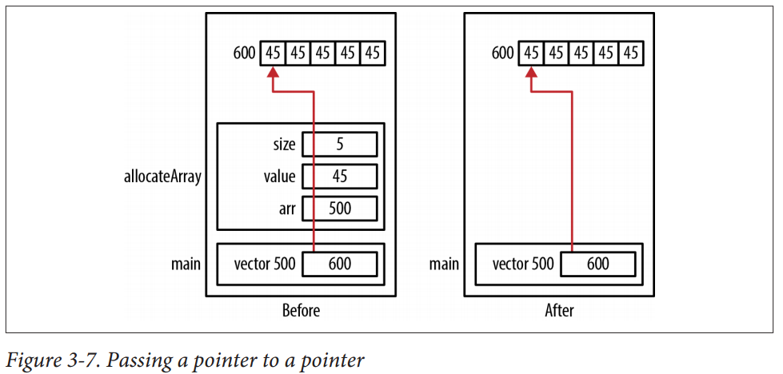
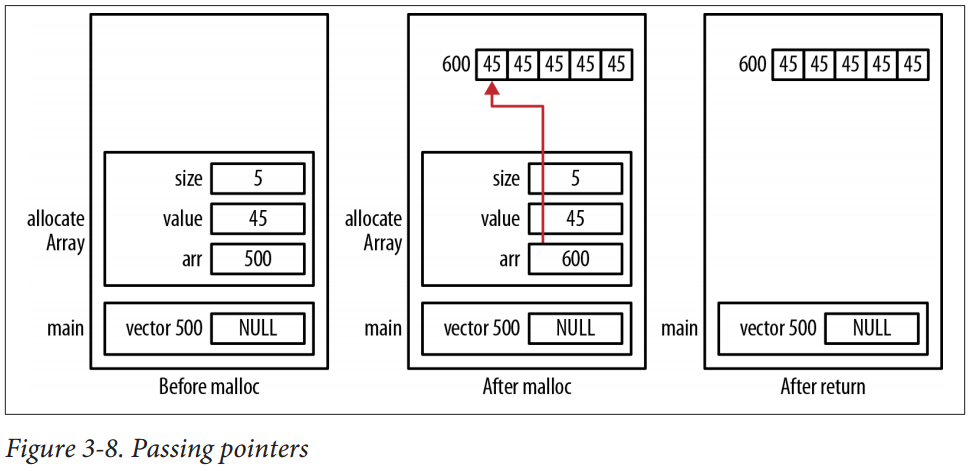

#
## C Technique

### [Advance Skill](https://shengwen1997.gitbooks.io/program_with_c/content/)

### [Wrap Printf](https://stackoverflow.com/questions/20639632/how-to-wrap-printf-into-a-function-or-macro)

```c
#include <stdarg.h>
#include <stdio.h>

void my_printf(const char *fmt, ...)
{
    va_list args;
    va_start(args, fmt);
    vprintf(fmt, args);
    va_end(args);
}
```

### [OOPS](https://shengwen1997.gitbooks.io/program_with_c/content/encapsulation.html)

+ Encapsulation

```c
#include <stdio.h>

struct Circle {
    void (*new)(struct Circle*, float);
    float (*area)(struct Circle*);
    float r;
};

float CircleArea(struct Circle *obj) { return 3.14 * obj->r * obj->r; }

void CircleNew(struct Circle *obj, float r) {
    obj->new = CircleNew;
    obj->area = CircleArea;
    obj->r = r;
}

int main() {
    struct Circle c;
    CircleNew(&c, 3.0);
    printf("area() = %G\n", c.area(&c));
}
```

### [Variable Arguments](https://www.tutorialspoint.com/cprogramming/c_variable_arguments.htm)

```c
#include <stdio.h>
#include <stdarg.h>

double average(int num,...)
{
    va_list valist;
    double sum = 0.0;
    int i;

    /* initialize valist for num number of arguments */
    va_start(valist, num);

    /* access all the arguments assigned to valist */
    for (i = 0; i < num; i++) {
        sum += va_arg(valist, int);
    }

    /* clean memory reserved for valist */
    va_end(valist);

    return sum/num;
}

int main()
{
    printf("Average of 2, 3, 4, 5 = %f\n", average(4, 2, 3, 4, 5));
    printf("Average of 5, 10, 15 = %f\n", average(3, 5, 10, 15));
}
```

### [Structure Padding](https://fresh2refresh.com/c-programming/c-structure-padding/)

```text
struct student
{
    int id1;
    int id2;
    char a;
    char b;
    float percentage;
};
```
1 word is equal to 4 bytes for 32 bit processor and 8 bytes for 64 bit processor. So, 32 bit
processor always reads 4 bytes at a time and 64 bit processor always reads 8 bytes at a time.
This concept is very useful to increase the processor speed.

### Marco printf

```text
#define ALOGD(f_, ...) \
    do {\
        printf((f_), __VA_ARGS__);\
        printf("\n"); \
    } while(0)
```

### Converting void pointers to function pointers

```c
void* voidptr = ...
int (*fptr)(int);
fptr = (int (*)(int))voidptr;
```
[reference linked](https://www.reddit.com/r/C_Programming/comments/63wyd7/converting_void_pointers_to_function_pointers/)

### Passing a Pointer to a Pointer

+ Right Way

When a pointer is passed to a function, `it is passed by value`. If we `want to modify the
original pointer` and not the copy of the pointer, we need to pass it as a pointer to a
pointer.

```c
void allocateArray(int **arr, int size, int value) {
    *arr = (int*)malloc(size * sizeof(int));
    if(*arr != NULL) {
        for(int i=0; i<size; i++) {
            *(*arr+i) = value;
        }
    }
}

void main(void) {
    int *vector = NULL;
    allocateArray(&vector, 5, 45);
}
```



+ Wrong Way

```c
/*There is pool answer*/
void allocateArray(int *arr, int size, int value) {
    arr = (int*)malloc(size * sizeof(int));
    if(arr != NULL) {
        for(int i=0; i<size; i++) {
            arr[i] = value;
        }
    }
}

void main(void) {
    int *vector = NULL;
    allocateArray(&vector, 5, 45);
    printf("%p\n" , vector);
}
```



### How to know stack and heap direction

```c
#include <stdlib.h>
#include <stdio.h>

void check(int depth) {
    char c;
    char *ptr = malloc(1);
    printf("stack at %p, heap at %p\n", &c, ptr);
    if (depth <= 0) return;
    check(depth-1);
}

int main() {
    check(10);
    return 0;
}
```

### [Structure and Pointer](https://www.programiz.com/c-programming/c-structures-pointers)

+ Referencing pointer to another address to access the memory

```c
#include <stdio.h>
typedef struct person
{
    int age;
    float weight;
};

int main()
{
    struct person *personPtr, person1;
    personPtr = &person1; // Referencing pointer to memory address of person1

    printf("Enter integer: ");
    scanf("%d",&(*personPtr).age);

    printf("Enter number: ");
    scanf("%f",&(*personPtr).weight);

    printf("Displaying: ");
    printf("%d%f",(*personPtr).age,(*personPtr).weight);

    return 0;
}
```

+ Using -> operator to access structure pointer member

```text
(*personPtr).age is same as personPtr->age
(*personPtr).weight is same as personPtr->weight
```

+ Accessing structure member through pointer using dynamic memory allocation

```c
#include <stdio.h>
#include <stdlib.h>
struct person {
    int age;
    float weight;
    char name[30];
};

int main()
{
    struct person *ptr;
    int i, num;

    printf("Enter number of persons: ");
    scanf("%d", &num);

    ptr = (struct person*) malloc(num * sizeof(struct person));
    // Above statement allocates the memory for n structures with pointer
    // personPtr pointing to base address */

    for(i = 0; i < num; ++i)
    {
        printf("Enter name, age and weight of the person
                respectively:\n");
        scanf("%s%d%f", &(ptr+i)->name, &(ptr+i)->age,
                &(ptr+i)->weight);
    }

    printf("Displaying Infromation:\n");
    for(i = 0; i < num; ++i)
    printf("%s\t%d\t%.2f\n",
            (ptr+i)->name, (ptr+i)->age,
            (ptr+i)->weight);

    return 0;
}
```

+ Output

```text
Enter number of persons: 2
Enter name, age and weight of the person respectively:
Adam
2
3.2
Enter name, age and weight of the person respectively:
Eve
6
2.3
Displaying Information:
Adam    2   3.20
Eve 6   2.30
```

### Pointer to `void`

A pointer to void will have the same representation and memory alignment as a
pointer to `char`.

A pointer to void will` never be equal to another pointer`. However, two void pointers
assigned a NULL value will be equal.

### NULL marco

```c
#define NULL ((void*)0)
```

### volatile

[reference.1](http://mropengate.blogspot.com/2017/08/cc-c.html),
[reference.2](https://rmbconsulting.us/publications/a-c-test-the-0x10-best-questions-for-would-be-embedded-programmers/)

由於嵌入式系統常處理 I/O、中斷、即時操作系統 (RTOS) 相關的問題，因此在嵌入式系統開發中 volatile
尤為重要。被 volatile 修飾的變數代表它可能會被不預期的更新，因此告知編譯器不對它涉及的地方做最佳化，
並在每次操作它的時候都讀取該變數實體位址上最新的值，而不是讀取暫存器的值。

volatile 常見的應用：
修飾中斷處理程式中 (ISR) 中可能被修改的全域變數。
修飾多執行緒 (multi-threaded) 的全域變數。
設備的硬體暫存器 (如狀態暫存器)

### pointer

```text
int a; // 一個整型數
int *a; // 一個指向整數的指標
int **a; // 一個指向指標的指標，它指向的指標是指向一個整型數
int a[10]; // 一個有10個整數型的陣列
int *a[10]; // 一個有10個指標的陣列，該指標是指向一個整數型的
int (*a)[10]; // 一個指向有10個整數型陣列的指標
int (*a)(int); // 一個指向函數的指標，該函數有一個整數型參數並返回一個整數
int (*a[10])(int); // 一個有10個指標的陣列，該指標指向一個函數，該函數有一個整數型參數並返回一個整數
```

### function pointer

```c
void (*fptr)(type_a, type_b) = &func;
```

### interruption fucntion

```c
__interrupt double compute_area(double radius) {
    double area = PI * radius * radius; 
    printf("\nArea = %f"， area);  return area;
}
```

1. ISR 不能返回一個值。如果你不懂這個，那麼你不會被雇用的.
2. ISR 不能傳遞參數。如果你沒有看到這一點，你被雇用的機會等同第一項.
3. 在許多的處理器/編譯器中，浮點一般都是不可重入的。有些處理器/編譯
器需要讓多餘的暫存器入棧(PUSH入堆疊),有些處理器/編譯器就是不允許在ISR
中做浮點運算.此外,ISR應該是短而有效率的,在ISR中做浮點運算是不明智的.
4. printf()經常有重入和性能上的問題。
如果你丟掉了第三和第四點，我不會太為難你的.
但如果你能得到後兩點,那麼你的被雇用前景越來越光明了。

### Using inline

其作用是將fucntion展開, 把fucntion的程式碼copy到每一個call place,
這樣在call function的過程就可以直接execute function code, 而不發生
jump, 進入stack等一般性fucntion manipuation, 可以節省時間, 提昇程式
executable speed.

```c
inline int f(int a, int b) {
    return a+b;
}

int main(void) {
    int c;
    c = f(1,2); /*=> 展開inline 成為 c = 1+2*/
    return 1;
}
```

### Using a Union to Represent a Value in Multiple Ways

```c
typedef union _conversion {
     float fNum;
      unsigned int uiNum;
} Conversion;
int isPositive1(float number) {
    Conversion conversion = { . fNum =number};
    return (conversion. uiNum & 0x80000000) == 0;
}

typedef union _conversion2 {
    float *fNum;
    unsigned int *uiNum;
} Conversion2;
int isPositive2(float number) {
    Conversion2 conversion;
    conversion.fNum =&number;
    return (*conversion.uiNum & 0x80000000) == 0;
}

int isPositive3(float number) {
    unsigned int *ptrValue = (unsigned int *)&number;
    return (*ptrValue & 0x80000000) == 0;
}
```

### Strict Aliasing Keyword

Strict aliasing is another form of aliasing. Strict aliasing does not allow a pointer of one
data type to alias a pointer of a different data type.

In the following code sequence, a pointer to an integer aliases a pointer to a float.
This violates the strict aliasing rule.

```c
float number = 3.25f;
unsigned int *ptrValue = (unsigned int *)&number;
unsigned int result = (*ptrValue & 0x80000000) == 0; /*a good way is for judgeting postive or nagtive*/
```

If your compiler has an option to disable strict aliasing,
it can be turned off. The GCC compiler has the following compiler options:
<br>-fno-strict-aliasing to turn it off
<br>-fstrict-aliasing to turn it on
<br>-Wstrict-aliasing to warn of strict aliasing-related problems

### Determining the Endianness of a Machine

```c
int num = 0x12345678;
char* pc = (char*) &num;
for (int i = 0; i < 4; i++) {
    printf("%p: %02x \n" , pc, (unsigned char) *pc++);
}

Output:
100: 78
101: 56
102: 34
103: 12 /*little-endian*/
```

### Accessing a Port

```c
/*
The volatile keyword qualifier indicates that the variable can
be changed outside of the program.

Using the volatile keyword will prevent the runtime system from using a register to
temporarily store the port value. Each port access requires the system to read or write
to the port instead of reading a possibly stale value stored in a register
*/

#define PORT 0xB0000000
unsigned int volatile * const port = (unsigned int *) PORT
*port = 0x0BF4; // write to the port
value = *port;  // read from the port
```

### Accessing a Special Purpose Address

```c
#define VIDEO_BASE 0xB8000
int *video = (int *) VIDEO_BASE;
*video = 'A';
```

### Setting a Start Address for the Array Used by Heap4

```c
/*Using GCC syntax*/
uint8_t ucHeap[configTOTAL_HEAP_SIZE] __attribute__ ((section(".my_heap"))); /*.my_heap should exist in linker file*/

/*Using IAR*/
uint8_t ucHeap[configTOTAL_HEAP_SIZE ] @ 0x20000000;
```

### Bit Manipulation

0s/1s a sequence of 1s or 0s.

```text
x ^ 0s = x
x ^ 1s = ~x
x ^ x = 0

x & 0s = 0
x & 1s = x
x & x = x

x | 0s = x
x | 1s = 1s
x | x = x
```

+ Get Bit

```c
boolean getbit(int num, int i) {
    return ((num & (1 << i)) != 0)
}
```

+ Set Bit

```c
int setBit(int num, int i) {
    return num | (1<<i);
}
```

+ Clear Bit

```c
int clearBit(int num, int i)
{
    int mask = ~(1<<i);
    return num & mask;
}
```

To clear all bits from the most significant bit through i(inclusive)

```c
int clearBitsMSBthroughI(int num, int i) {
    int mask = (1<<i)-1;
    return num & mask;
}
```

To clear all bits from i through 0(inclusive)

```c
int clearBitsIthrough0(int num, int i) {
    int mask = (-1<<(i+1));
    return num & mask;
}
```

Update Bit

```c
int updateBit(int num, int i, boolean bitIs1) {
    int value = bitIs1? 1 :0;
    int mask = ~(1<<i);
    return (num&mask) | (value<<i);
}
```

```c
#define BIT_MASK(bitn) \
    ((1U << (bitn)) - 1)

#define BIT_SET(data, bitn) \
    data |= (1UL << bitn)

#define BIT_CLR(data, bitn) \
    data &= ~(1UL << bitn)

#define BIT_TOGGLE(data, bitn) \
    data ^= (1UL << bitn)

#define BIT_CHECKED(data, bitn) \
    (data >> bitn) & 1U

#define BIT_SET_NTH_BIT(data, bitn, binary) \
    data ^= (-binary ^ data) & (1UL << bitn)
```

### while

+ some condition

```c
while (...) {
  break;  /*leave loop*/
}

while (...) {
  continue;   /*go to while*/
}
```
### for

for (initial variable; judge expression; execute code)

```c
for (int counter = 1; counter < 11; counter ++)
```

### if

```c
if (intput > 0)
  classify = "postive"
else
  classify = "negative"

/*equal to*/
classify = (input)? "postive": "negative";
```

### Print memory address

```c
printf("x %p\n", &x); /*%p is meaning: showing x address as HEX format output*/
```

### How to read pointer

+ const int\*, const int \* const, and int const \*

<br>


<br>


<br>


<br>


### Get struct member size

```c
#define member_size(type, member) sizeof(((type *)0)->member)

typedef struct
{
    float calc;
    char text[255];
    int used;
} Parent;

typedef struct
{
    char flag;
    char text[member_size(Parent, text)];
    int used;
} Child;

printf("%zu", member_size(Parent,text));
```

### Get array size

```c
#define ARRAY_SIZE(a) (sizeof((a)) / sizeof((a)[0]))
```

### union and sturct

`union`提供memory足以存放最大SIZE的空間

+ union initialize

```c
typedef union {
  shot count;   //2 bytes
  float weight; //4 bytes
  float volume; //4 bytes
} quantity; //this is 4 bytes size

/*initialize a union*/
quantity q = {4}; //set 4 to count

/*set weight*/
quantity q = {.weight=1.5};
```

+ structure initialize

```c
struct bick_t {
  const char* color;
  int gears;
  int height;
} bick = {.height = 17, .gears = 21};
```

### Pointer Array

```c
static int
print_pointer_array_void(const void* const rawin[])
{
    printf("acc(%d,%d,%d)gyro(%d,%d,%d)mag(%d,%d,%d)hrm(%d,%d,%d)pre(%d)tmp(%d)dt(%d)logcnt(%d)\n",
            (int)(*((float*)rawin[ACC]+0)*1000),
            (int)(*((float*)rawin[ACC]+1)*1000),
            (int)(*((float*)rawin[ACC]+2)*1000),
            (int)(*((float*)rawin[GYR]+0)*1000),
            (int)(*((float*)rawin[GYR]+1)*1000),
            (int)(*((float*)rawin[GYR]+2)*1000),
            (int)(*((float*)rawin[MAG]+0)*1000),
            (int)(*((float*)rawin[MAG]+1)*1000),
            (int)(*((float*)rawin[MAG]+2)*1000),
            (int)*((float*)rawin[HEARTRATE]+0),
            (int)*((float*)rawin[HEARTRATE]+1),
            (int)*((float*)rawin[HEARTRATE]+2),
            (int)(*((float*)rawin[PRESSURE]+0)*1000),
            (int)(*((float*)rawin[TEMPERATURE]+0)*1000));

    return 0;
}

void print_pointer_array_int(int *p[])
{
  for(int i = 0; i < 3; i++) {
    for (int j = 0; j < 3; j++) {
      printf("p[%d][%d] = %d\n", i, j,  *(p[i] + j));
    }
  }
}

void main(void)
{
  int acc[3] = {1, 2, 3};
  int gyro[3] = {4, 5, 6};
  int mag[3] = {7, 8, 9};
  int *p[3]= {NULL, };
  p[0] = acc;
  p[1] = gyro;
  p[2] = mag;

  const void* const rawin[PORT_RAWSENSORS_MAX] = {
      mTask.rawsensfeedback.accelero_fb,
      mTask.rawsensfeedback.gyroscope_fb,
      mTask.rawsensfeedback.magneto_fb,
      mTask.rawsensfeedback.pressure_fb,
      mTask.rawsensfeedback.temperature_fb,
      mTask.rawsensfeedback.proximity_fb,
      mTask.rawsensfeedback.heartrate_fb,
      &mTask.rawsensfeedback.gnss_fb
  };

  print_pointer_array_int(p);
  print_pointer_array_void(rawin);
}
```
### How to get stack, bss address

```c
extern const int __stack, _bss_end;
int startAddr = (int)&__stack;
int endAddr = (int)&_bss_end;
```

### Training

[geeksforgeeks](https://www.geeksforgeeks.org/)
<br>[codility](https://www.codility.com/)

### Question

+ Question.1

```c
void foo(void) {
    unsigned int a = 6;
    int b = -20;
    (a+b > 6) ? puts("> 6") : puts("<= 6");
}
```
```text
unsigned int的答案是輸出是 "> 6".
當表達式中存在有符號類型和無符號類型時所有的操作數都自動轉換為無符號類型(unsigned)。
因此-20變成了一個非常大的正整數，所以該表達式計算出的結果大於6.
這一點對於應當頻繁用到無符號數據類型的嵌入式系統來說是非常重要的。
如果你答錯了這個問題，你也就到了得不到這份工作的邊緣。
```

+ Question.2

```c
#include <stdio.h>
#include <stdlib.h>

union _a
{
    unsigned int x;
    char y[4];
    unsigned short z;
};

int main(void)
{
    union _a A;

    A.y[0] = 0x0a;
    A.y[1] = 0x0b;
    A.y[2] = 0x0c;
    A.y[3] = 0x0d;
    A.z = 0xAA;
    A.x = 0x11223344;

    printf("%ld\n", sizeof(A));
    printf("%x\n", A.y[1]);
}
```
sizeof(A) = ?
```text
4
```

在little endian cpu中, A.y[1]的值將會是?
```text
0x33
```

在big endian cpu中, A.y[1]的值將會是?
```text
0x22
```

+ Question.3

```c
#include <stdio.h>
#include <stdlib.h>

#define CALC(x,y) x*y

int main(void)
{
    int i;
    i = CALC(5+5, 6+6);
    printf("%d\n", i);
}
```

i的值將會是?
```text
41
```

請將上題的CALC 改用inline function實作, 請寫出實作?
```c
inline int CALC(int x, int y) { return (x*y); }
```

使用inline function後, i 的值將會是?
```c
120
```

+ Question.4

```c
#include <stdio.h>
#include <stdlib.h>

int Action1(int x);
int Action1(int x)
{
    return (x*2);
}

int Action2(int x);
int Action2(int x)
{
    return (x<<1);
}

int main (void)
{
    // 這邊缺少函式指標陣列的宣告

    a[0] = Action1;
    a[1] = Action2;

    printf("%d\n", a[0](4));
    printf("%d\n", a[1](5));
}
```

麻煩將a這個函式指標陣列的宣告補上?
```c
int (*a[2]) (int x);
```

請問兩個printf的結果是?
```text
8
10
```

+ Question.5

```c
#include <stdio.h>
#include <stdlib.h>

struct Alignment
{
    char a;
    short int e;
    char c;
    char d;
    int b;
};

int main(void)
{
    printf("%ld\n", sizeof(struct Alignment));
}
```

請問在"32bit cpu,有開啟Alignment"功能的狀況下,sizeof(struct Alignment)的值將會是多少?
```text
12
```

請問該如何disable alignment?
```text
In GCC you can use __attribute__((packed))
struct Alignment
{
    char a;
    short int e;
    char c;
    char d;
    int b;
} __attribute__((packed));
```

Disable alignment後, sizeof(struct Alignment)的值是多少?
```text
9
```

[reference](https://stackoverflow.com/questions/40642765/how-to-tell-gcc-to-disable-padding-inside-struct)

+ Question.6

```c
// C-Quiz 6
// ---------------------------------------------
// Define a macro can tell the element number inside a static array?
// ---------------------------------------------
```
```c
ARRAY_SIZE(a) (sizeof((a))/sizeof((a)[0]))
```

+ Question.7

```c
// C-Quiz 7
// ---------------------------------------------
// 請聊聊 volatile 跟他的用途?
// ---------------------------------------------
```

+ Question.8

```
// C-Quiz 8
// ---------------------------------------------
// 請聊聊 stack / heap 跟他的用途?
// ---------------------------------------------
```

Program Stack
1. The program stack is an area of memory that supports the execution of functions and
is normally shared with the heap.

2. program stack tends to occupy the lower part of this region, while the heap uses the
upper part

3. The program stack holds stack frames, sometimes called activation records or activation
frames. Stack frames hold the parameters and local variables of a function.

Heap
The heap manages dynamic memory and is discussed

As functions are called, their stack frames are pushed onto the stack and the stack grows
“upward.” When a function terminates, its stack frame is popped off the program stack.
The memory used by the stack frame is not cleared and may eventually be overridden
by another stack frame when it is pushed onto the program stack.

When memory is dynamically allocated, it comes from the heap, which tends to grow
“downward.” The heap will fragment as memory is allocated and then deallocated. Al‐
though the heap tends to grow downward, this is a general direction. Memory can be
allocated from anywhere within the heap.

+ Question.9

```c
// ---------------------------------------------
// 請聊聊 static 跟他的用途?
// ---------------------------------------------
```

+ Question.10

```c
// ---------------------------------------------
// 請聊聊 extern 跟他的用途?
// ---------------------------------------------
```

## Astyle

```text
apt-get install astyle
```

+ Normally usage

```text
astyle --style=linux -pHk3 *.c/*.h
```

+ astylerc

```text
# this line is a comment
--style=linux      # this is a line-end comment

# Insert space padding around operators.
--pad-oper

# Insert space padding between a header (e.g. 'if', 'for', 'while'...)
--pad-header

# Attach a pointer or reference operator (*, &, or ^) to either the variable type (left) or variable name (right), or place it between the type and name (middle).
--align-pointer=name

# This option will align references separate from pointers.
--align-reference=name

# Do not retain a backup of the original file
--suffix=none

# Indent 'switch' blocks so that the 'case X:'
--indent-switches

# Indent using # spaces per indent.
--indent=spaces=4

# Delete empty lines within a function or method.
--delete-empty-lines

#Set the minimal indent that is added when a header is built of multiple lines.
--min-conditional-indent=0

# Indent a maximal # spaces in a continuous statement,
--max-instatement-indent=40

# The option max-code-length will break a line if the code exceeds # characters.
--max-code-length=80
--break-after-logical
```

[Quick Start](http://astyle.sourceforge.net/astyle.html#_Quick_Start)


