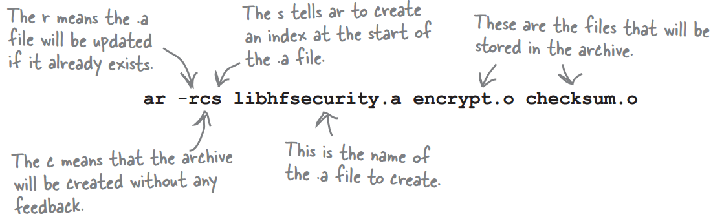
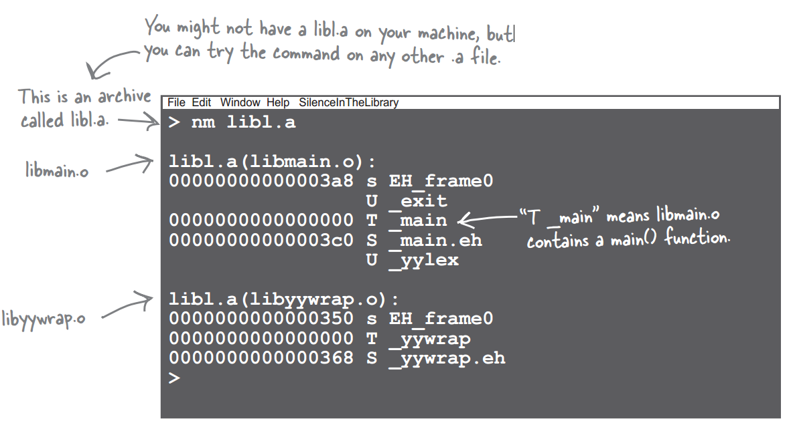
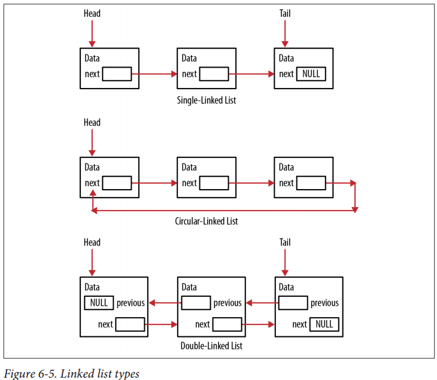

## Archive File (\*.a)
+ Create an archive with the ar command (archive command (ar))

```text
ar -rcs libhfsecurity.a encrypt.o checksum.o
```
<br>


+ Use an Archive File

```text
$ gcc test_code.c -lhfsecurity -o test_code
-l: If you’re using several archivesyou can set several -l options.

$ gcc test_code.c -L/my_lib -lhfsecurity -o test_code
-L: To say which directories to search
```

+ Can I extract a single object file from an archive?

```text
$ ar -x libhfsecurity.a encrypt.o
```

+ If I’ve created a library archive, can I see what’s inside it?

```text
$ ar -t <filename>
```

## nm Linux Command

+ Look inside an archive (\*.a) <br>
libl.a contains libmain.o and libyywrap.o

```text
$ nm liba.a #look inside an archive
```
<br>



+ Display Object Files that Refer to a Symbol <br>
[10 Practical Linux nm Command Examples](https://www.thegeekstuff.com/2012/03/linux-nm-command/) <br>
[Linux nm Command Tutorial for Beginners (10 Examples)](https://www.howtoforge.com/linux-nm-command/) <br>

The following command displays all the object files that refer to the symbol ‘func’ in my current directory

```text
$ nm  -A ./*.o | grep func

./hello2.o:0000000000000000 T func_1
./hello3.o:0000000000000000 T func_2
./hello4.o:0000000000000000 T func_3
./main.o:                   U func
./reloc.o:                  U func
./reloc.o:0000000000000000  T func1
./test1.o:0000000000000000  T func
./test.o:                   U func
```
## OS

+ [spinlock, mutex,semaphore](http://welkinchen.pixnet.net/blog/post/47071066-spinlock-%26-mutex-%26-semaphore-%E7%9A%84%E4%BD%9C%E7%94%A8%E5%92%8C%E5%8D%80%E5%88%A5)

```text
Mutex是一把鑰匙，一個人拿了就可進入一個房間，出來的時候把鑰匙交給隊列的第一個。一般的用法是用於串行化對critical
section代碼的訪問，保證這段代碼不會被並行的運行。
(A mutex is really a semaphore with value 1.)

Semaphore是一件可以容納N人的房間，如果人不滿就可以進去，如果人滿了，就要等待有人出來。對於N=1的情況，稱為binary
semaphore。一般的用法是，用於限制對於某一資源的同時訪問。

Binary semaphore與Mutex的差異：
在有的系統中Binary semaphore與Mutex是沒有差異的。在有的系統上，主要的差異是mutex一定要由獲得鎖的進程來釋放。而semaphore可以由其它進程釋放（這時的semaphore實際就是個原子的變量，大家可以加或減），因此semaphore可以用於進程間同步。
Semaphore的同步功能是所有系統都支持的，而Mutex能否由其他進程釋放則未定，因此建議mutex只用於保護critical
section。而semaphore則用於保護某變量，或者同步。

spin lock，這是一個內核態概念。 spin lock與semaphore的主要區別是spin lock是busy
waiting，而semaphore是sleep。對於可以sleep的進程來說，busy
waiting當然沒有意義。對於單CPU的系統，busy
waiting當然更沒意義（沒有CPU可以釋放鎖）。因此，只有多CPU的內核態非進程空間，才會用到spin lock。
Linux kernel的spin
lock在非SMP的情況下，只是關irq，沒有別的操作，用於確保該段程序的運行不會被打斷。其實也就是類似mutex的作用，串行化對critical
section的訪問。但是mutex不能保護中斷的打斷，也不能在中斷處理程序中被調用。而spin
lock也一般沒有必要用於可以sleep的進程空間。
```

+ [Mutexes VS Semaphores大揭秘](http://swem.logdown.com/posts/177651-mutexes-and-semaphores-demystified)

```text
Mutex 與 Semaphore 都是用在保護 critical section，確保多個 process
平行運作並存取資源時，執行結果不會因為執行程序的時間先後的影響而導致錯誤。
Mutex(Mutual Exclusion) 與 Semaphore 的差別在於:

process 使用 mutex 時，process 的運作是持有 Mutex，執行critical section 來存取資源，然後釋放 Mutex.
Mutex 就像是資源的一把鎖。
process 使用 semaphore 時，process 總是發出信號(signal)，或者總是接收信號(wait)，同一個 process
不會先後進行 signal 與 wait。也就是說，process 要嘛當 producer，要嘛當
consumer，不能兩者都是。Semaphore 是為了保護 process 的執行同步性。
Mutex 與 Semaphore 要解決的是不同的問題。了解這個部份後，就可以來區分 mutex 與 binary
semaphore。mutex 確保數個 process 在一個時間點上，只能有一個 process 存取單項資源，而 semaphore
則是讓數個 producer 與 數個 consumer 在訊號上進行合作。

另一個 mutex 與 binary semaphore 的差異在於，使用 mutex 會導致 priority inversion。也因此 mutex
中多半採用了一些機制來防止 Priority Inversion。Priority Inversion 是基於 process 持有 mutex
的概念，使得數個不同 priority 的 process ，在等待資源時透過 mutex 傳遞 priority，避免 priority
inversion 發生。

註：Mutex與Semaphore在很多書、文章中都有很多不同的解釋。我認為這篇文章談的是最嚴格定義的 Semaphore
(Dijkstra 所提出)，因此兩者有相當不同的區分。而後衍生出的 semaphore ，則包含了 counting semaphore 與
binary semaphore，也才能夠用於保護資源，或是處理 multiple identical resources 的問題。
```

+ Priority inversion

```text
http://blog.linux.org.tw/~jserv/archives/001299.html
http://wen00072.github.io/blog/2014/03/05/note-priority-inversion-on-mars/

Bounded priority inversion
高優先權的process/thread等待進入critical section，該critical
section目前由低優先權的process/thread佔用中。因此只要低優先權的process/thread離開該critical
section後高優先權的process/thread便可繼續執行

Unbounded priority inversion
高優先權的process/thread等待進入critical section，該critical
section目前由低優先權的process/thread佔用中
不幸的是，當低優先權process/thread還在critical
section執行的時候，被切換到中優先權的process/thread由於高優先權的process/thread被block，而低優先權的process/thread一定會被中優先權的process/thread搶走執行權。最壞的狀況就是之後就只剩中優先權的process/thread被執行

解法？
Priority inheritance
當高優先權的process/thread要進入critical
section發現該section以被低優先權的process/thread佔用時，系統暫時將該低優先權的process/thread調整到高優先權直到該低優先權的process/thread離開critical
section
看來可以解Unbounded priority inversion，bounded priority inversion應該還是本質無法解掉？
```

## Virtual Memory


## C Technique

+ volatile

```text
http://mropengate.blogspot.com/2017/08/cc-c.html
https://rmbconsulting.us/publications/a-c-test-the-0x10-best-questions-for-would-be-embedded-programmers/

由於嵌入式系統常處理 I/O、中斷、即時操作系統 (RTOS) 相關的問題，因此在嵌入式系統開發中 volatile
尤為重要。被 volatile 修飾的變數代表它可能會被不預期的更新，因此告知編譯器不對它涉及的地方做最佳化，
並在每次操作它的時候都讀取該變數實體位址上最新的值，而不是讀取暫存器的值。

volatile 常見的應用：
修飾中斷處理程式中 (ISR) 中可能被修改的全域變數。
修飾多執行緒 (multi-threaded) 的全域變數。
設備的硬體暫存器 (如狀態暫存器)
```

+ pointer

```text
int a; // 一個整型數
int *a; // 一個指向整數的指標
int **a; // 一個指向指標的指標，它指向的指標是指向一個整型數
int a[10]; // 一個有10個整數型的陣列
int *a[10]; // 一個有10個指標的陣列，該指標是指向一個整數型的
int (*a)[10]; // 一個指向有10個整數型陣列的指標
int (*a)(int); // 一個指向函數的指標，該函數有一個整數型參數並返回一個整數
int (*a[10])(int); // 一個有10個指標的陣列，該指標指向一個函數，該函數有一個整數型參數並返回一個整數
```

+ function pointer

```c
void (*fptr)(type_a, type_b) = &func;
```

+ Question

```c
void foo(void) {
    unsigned int a = 6;
    int b = -20;
    (a+b > 6) ? puts("> 6") : puts("<= 6");
}
```
```text
unsigned int的答案是輸出是 "> 6".
當表達式中存在有符號類型和無符號類型時所有的操作數都自動轉換為無符號類型(unsigned)。因此-20變成了一個非常大的正整數，所以該表達式計算出的結果大於6.
這一點對於應當頻繁用到無符號數據類型的嵌入式系統來說是非常重要的。如果你答錯了這個問題，你也就到了得不到這份工作的邊緣。
```

+ interruption fucntion

```c
__interrupt double compute_area(double radius) {
    double area = PI * radius * radius; 
    printf("\nArea = %f"， area);  return area;
}
```
```text
1. ISR 不能返回一個值。如果你不懂這個，那麼你不會被雇用的.
2. ISR 不能傳遞參數。如果你沒有看到這一點，你被雇用的機會等同第一項.
3. 在許多的處理器/編譯器中，浮點一般都是不可重入的。有些處理器/編譯器需要讓多餘的暫存器入棧(PUSH入堆疊)，有些處理器/編譯器就是不允許在ISR中做浮點運算。此外，ISR應該是短而有效率的，在ISR中做浮點運算是不明智的.
4. printf()經常有重入和性能上的問題。
如果你丟掉了第三和第四點，我不會太為難你的。但如果你能得到後兩點，那麼你的被雇用前景越來越光明了。
```

+ Using inline

其作用是將fucntion展開, 把fucntion的程式碼copy到每一個call place,
這樣在call function的過程就可以直接execute function code, 而不發生
jump, 進入stack等一般性fucntion manipuation, 可以節省時間, 提昇程式
executable speed.

```c
inline int f(int a, int b) {
    return a+b;
}

int main(void) {
    int c;
    c = f(1,2); /*=> 展開inline 成為 c = 1+2*/
    return 1;
}
```

+ Using Pointers to Support a Queue

```c
typedef LinkedList Queue;

void
initializeQueue(Queue* queue)
{
    initializeList(queue);
}

void
enqueue(Queue* queue, void* node)
{
    addHead(queue, node);
}

void*
dequeue(Queue* queue)
{
    Node* tmp = queue->head;
    void* data;
    if (queue->head == NULL)
        data = NULL;
    else if (queue->head == queue->tail) {
        queue->head = queue->tail = NULL;
        data = tmp->data;
        free(tmp);
    } else {
        while (tmp->next != queue->tail)
            tmp = tmp->next;
        queue->tail = tmp;
        tmp = tmp->next;
        queue->tail->next = NULL;
        data = tmp->data;
        free(tmp);
    }
    return data;
}

void
main(void)
{
    Queue queue;
    initializeQueue(&queue);
    enqueue(&queue, samuel);
    enqueue(&queue, sally);
    enqueue(&queue, susan);
    void* data = dequeue(&queue);
    printf("Dequeued %s\n", ((Employee*) data)->name);
    data = dequeue(&queue);
    printf("Dequeued %s\n", ((Employee*) data)->name);
    data = dequeue(&queue);
    printf("Dequeued %s\n", ((Employee*) data)->name);
    /*
    The output of this sequence follows:
    Dequeued Samuel
    Dequeued Sally
    Dequeued Susan
    */
}
```

+ Using Pointers to Support Linked List

<br>


```c
typedef struct _employee {
    char name[32];
    unsigned char age;
} Employee;

typedef struct _node {
    void* data;
    struct _node* next;
} Node;

typedef struct _linkedList {
    Node* head;
    Node* tail;
    Node* current;
} LinkedList;

typedef void(*DISPLAY)(void*);
typedef int(*COMPARE)(void*, void*);

void initializeList(LinkedList*);   //Initializes the linked list
void addHead(LinkedList*, void*);   //Adds data to the linked list’s head
void addTail(LinkedList*, void*);   //Adds data to the linked list’s tail
void delete (LinkedList*, Node*);   //Removes a node from the linked list
Node* getNode(LinkedList*, COMPARE, void*); //Returns a pointer to the node containing a specific data item
void displayLinkedList(LinkedList*, DISPLAY); //Displays the linked list

int
compareEmployee(Employee* e1, Employee* e2)
{
    return strcmp(e1->name, e2->name);
}

void
displayEmployee(Employee* employee)
{
    printf("%s\t%d\n", employee->name, employee->age);
}

void
initializeList(LinkedList* list)
{
    list->head = NULL;
    list->tail = NULL;
    list->current = NULL;
}

void
addHead(LinkedList* list, void* data)
{
    Node* node = (Node*) malloc(sizeof(Node));
    node->data = data;
    if (list->head == NULL) {
        list->tail = node;
        node->next = NULL;
    } else
        node->next = list->head;
    list->head = node;
}

void
addTail(LinkedList* list, void* data)
{
    Node* node = (Node*) malloc(sizeof(Node));
    node->data = data;
    node->next = NULL;
    if (list->head == NULL)
        list->head = node;
    else
        list->tail->next = node;
    list->tail = node;
}

Node*
getNode(LinkedList* list, COMPARE compare, void* data)
{
    Node* node = list->head;
    while (node != NULL) {
        if (compare(node->data, data) == 0)
            return node;
        node = node->next;
    }
    return NULL;
}

void
delete(LinkedList* list, Node* node)
{
    if (node == list->head) {
        if (list->head->next == NULL)
            list->head = list->tail = NULL;
        else
            list->head = list->head->next;
    } else {
        Node* tmp = list->head;
        while (tmp != NULL && tmp->next != node)
            tmp = tmp->next;
        if (tmp != NULL)
            tmp->next = node->next;
    }
    free(node);
}

void
displayLinkedList(LinkedList* list, DISPLAY display)
{
    printf(" \nLinked List\n" );
    Node* current = list->head;
    while (current != NULL) {
        display(current->data);
        current = current->next;
    }
}

void
main(void)
{
    LinkedList linkedList;
    Employee* samuel = (Employee*) malloc(sizeof(Employee));
    strcpy(samuel->name, "Samuel" );
    samuel->age = 32;
    Employee* sally = (Employee*) malloc(sizeof(Employee));
    strcpy(sally->name, "Sally" );
    sally->age = 28;
    Employee* susan = (Employee*) malloc(sizeof(Employee));
    strcpy(susan->name, "Susan" );
    susan->age = 45;
    initializeList(&linkedList);
    addHead(&linkedList, samuel);
    addHead(&linkedList, sally);
    addHead(&linkedList, susan);
    addTail(&linkedList, susan);
    addTail(&linkedList, sally);
    addTail(&linkedList, samuel);
    displayLinkedList(&linkedList, (DISPLAY)displayEmployee);
    /*
        The output of this sequence follows:
        Linked List
        Susan 45
        Sally 28
        Samuel 32
    */
    /*perform comparisons*/
    Node* node = getNode(&linkedList,
            (int (*)(void*, void*))compareEmployee, sally);
    delete (&linkedList, node);
}
```

+ Using a Union to Represent a Value in Multiple Ways

```c
typedef union _conversion {
     float fNum;
      unsigned int uiNum;
} Conversion;
int isPositive1(float number) {
    Conversion conversion = { . fNum =number};
    return (conversion. uiNum & 0x80000000) == 0;
}

typedef union _conversion2 {
    float *fNum;
    unsigned int *uiNum;
} Conversion2;
int isPositive2(float number) {
    Conversion2 conversion;
    conversion.fNum =&number;
    return (*conversion.uiNum & 0x80000000) == 0;
}

int isPositive3(float number) {
    unsigned int *ptrValue = (unsigned int *)&number;
    return (*ptrValue & 0x80000000) == 0;
}

```

+ Strict Aliasing Keyword

```text
Strict aliasing is another form of aliasing. Strict aliasing does not allow a pointer of one
data type to alias a pointer of a different data type.

In the following code sequence, a pointer to an integer aliases a pointer to a float.
This violates the strict aliasing rule.
```
```c
float number = 3.25f;
unsigned int *ptrValue = (unsigned int *)&number;
unsigned int result = (*ptrValue & 0x80000000) == 0; /*a good way is for judgeting postive or nagtive*/
```
```text
If your compiler has an option to disable strict aliasing,
it can be turned off. The GCC compiler has the following compiler options:
-fno-strict-aliasing to turn it off
-fstrict-aliasing to turn it on
-Wstrict-aliasing to warn of strict aliasing-related problems
```

+ Determining the Endianness of a Machine

```c
int num = 0x12345678;
char* pc = (char*) &num;
for (int i = 0; i < 4; i++) {
    printf("%p: %02x \n" , pc, (unsigned char) *pc++);
}

Output:
100: 78
101: 56
102: 34
103: 12 /*little-endian*/
```

+ Accessing a Port

```c
/*
The volatile keyword qualifier indicates that the variable can
be changed outside of the program.

Using the volatile keyword will prevent the runtime system from using a register to
temporarily store the port value. Each port access requires the system to read or write
to the port instead of reading a possibly stale value stored in a register
*/

#define PORT 0xB0000000
unsigned int volatile * const port = (unsigned int *) PORT
*port = 0x0BF4; // write to the port
value = *port;  // read from the port
```

+ Accessing a Special Purpose Address

```c
#define VIDEO_BASE 0xB8000
int *video = (int *) VIDEO_BASE;
*video = 'A';
```

+ Setting a Start Address for the Array Used by Heap4

```c
/*Using GCC syntax*/
uint8_t ucHeap[configTOTAL_HEAP_SIZE] __attribute__ ((section(".my_heap"))); /*.my_heap should exist in linker file*/

/*Using IAR*/
uint8_t ucHeap[configTOTAL_HEAP_SIZE ] @ 0x20000000;
```

+ Bit Manipulation

```c
#define BIT_MASK(bitn) \
    ((1U << (bitn)) - 1)

#define BIT_SET(data, bitn) \
    data |= (1UL << bitn)

#define BIT_CLR(data, bitn) \
    data &= ~(1UL << bitn)

#define BIT_TOGGLE(data, bitn) \
    data ^= (1UL << bitn)

#define BIT_CHECKED(data, bitn) \
    (data >> bitn) & 1U

#define BIT_SET_NTH_BIT(data, bitn, binary) \
    data ^= (-binary ^ data) & (1UL << bitn)
```

+ while (some condition)

```c
while (...) {
  break;  /*leave loop*/
}

while (...) {
  continue;   /*go to while*/
}
```
+ for (initial variable; judge expression; execute code)

```c
for (int counter = 1; counter < 11; counter ++)
```

+ if

```c
if (intput > 0)
  classify = "postive"
else
  classify = "negative"

/*equal to*/
classify = (input)? "postive": "negative";
```

+ Print memory address

```c
printf("x %p\n", &x); /*%p is meaning: showing x address as HEX format output*/
```

+ const int\*, const int \* const, and int const \*

<br>


<br>


<br>


<br>


+ **(\*t).age != \*t.age**

```text
(*t).age is not equal to *t.age
(*t).age = t->age
*t.age = *(t.age) # it refer as memory address
ptr->field = (*ptr).field
```

+ Get struct member size

```c
#define member_size(type, member) sizeof(((type *)0)->member)

typedef struct
{
    float calc;
    char text[255];
    int used;
} Parent;

typedef struct
{
    char flag;
    char text[member_size(Parent, text)];
    int used;
} Child;

printf("%zu", member_size(Parent,text));
```

+ Get array size

```c
#define ARRAY_SIZE(a)   (sizeof((a)) / sizeof((a)[0]))
```

+ union and sturct
<br> **union**: 提供memory足以存放最大SIZE的空間
<br> union initialize

```c
typedef union {
  shot count;   //2 bytes
  float weight; //4 bytes
  float volume; //4 bytes
} quantity; //this is 4 bytes size

/*initialize a union*/
quantity q = {4}; //set 4 to count

/*set weight*/
quantity q = {.weight=1.5};
```
<br> structure initialize

```c
struct bick_t {
  const char* color;
  int gears;
  int height;
} bick = {.height = 17, .gears = 21};
```

+ array pointer

```c
void print_pointer_array(int *p[])
{
  for(int i = 0; i < 3; i++) {
    for (int j = 0; j < 3; j++) {
      printf("p[%d][%d] = %d\n", i, j,  *(p[i] + j));
    }
  }
}

void main(void)
{
  int acc[3] = {1, 2, 3};
  int gyro[3] = {4, 5, 6};
  int mag[3] = {7, 8, 9};
  int *p[3]= {NULL, };
  p[0] = acc;
  p[1] = gyro;
  p[2] = mag;
  print_pointer_array(p);
}
```

## GCC(GNU Compiler Collection)
<!---
<br> gcc -c/-S/-E/-o/-l/-L/-g
-->
<br> [reference link.1](https://wizardforcel.gitbooks.io/100-gcc-tips/content/syntax-only.html)
<br> syntax checking

```bash
gcc -fsyntax-only foo.c
```

```text
# [-c] and [-o] - Create a executable file
gcc -c test1.c test2.c test3.c -o test
=> 等效於
gcc -c test1.c test2.c test3.c
gcc test1.o test2.o test3.o -o test

:-c \*.c  # create \*.c to objective code
:-o \*.o -# Link all objective code to a executable file

# [-c] Create objective files
gcc -c test1.c test2.c test3.c
Noted: if -o exincludes, compiler cannot find out linking error.

# [-S] Compile c file to ASM
gcc -S test.c

# [-E] 將原始檔案(*.c)作進行預先處理而不是進行compile
可以用來展開marco, file include issue
gcc -E main.c -o maine.c

# [-l] include header file with particular path

# [-L] 指定 library 路徑

# [-g] it is used to gdb
會產生符號表, 讓gdb 工具可以除錯
```

## valgrid
## Makefile
<br> Only output error message on screen

```text
make 1 > build.log
1 meaning standard output
2 meaning standard error output
```

## Astyle

```text
apt-get install astyle
```

+ Normally usage

```text
astyle --style=linux -pHk3 *.c/*.h
```

+ astylerc

```text
# this line is a comment
--style=linux      # this is a line-end comment

# Insert space padding around operators.
--pad-oper

# Insert space padding between a header (e.g. 'if', 'for', 'while'...)
--pad-header

# Attach a pointer or reference operator (*, &, or ^) to either the variable type (left) or variable name (right), or place it between the type and name (middle).
--align-pointer=name

# This option will align references separate from pointers.
--align-reference=name

# Do not retain a backup of the original file
--suffix=none

# Indent 'switch' blocks so that the 'case X:'
--indent-switches

# Indent using # spaces per indent.
--indent=spaces=4

# Delete empty lines within a function or method.
--delete-empty-lines

#Set the minimal indent that is added when a header is built of multiple lines.
--min-conditional-indent=0

# Indent a maximal # spaces in a continuous statement,
--max-instatement-indent=40

# The option max-code-length will break a line if the code exceeds # characters.
--max-code-length=80
--break-after-logical
```

[Quick Start](http://astyle.sourceforge.net/astyle.html#_Quick_Start)


