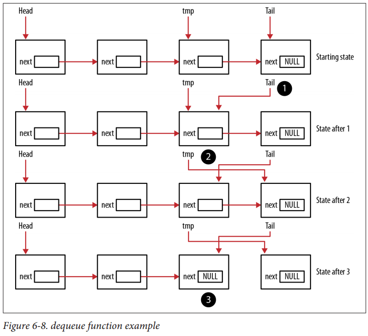
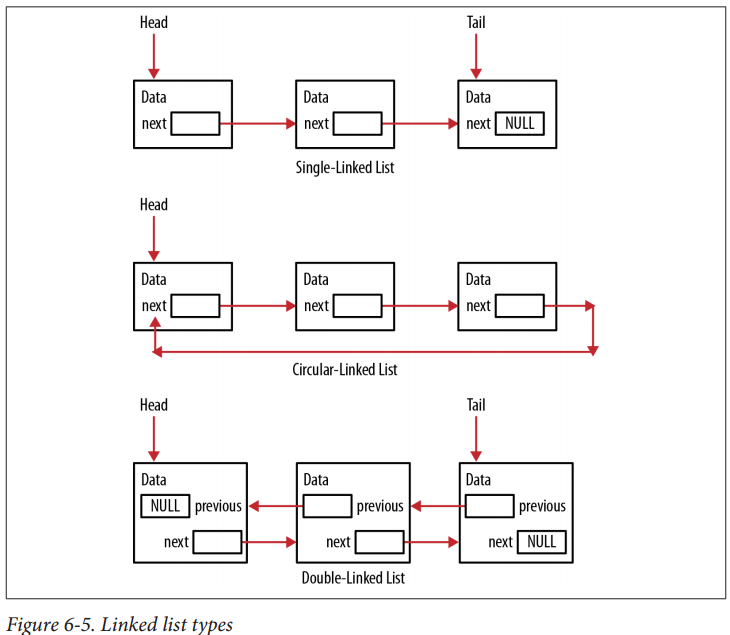
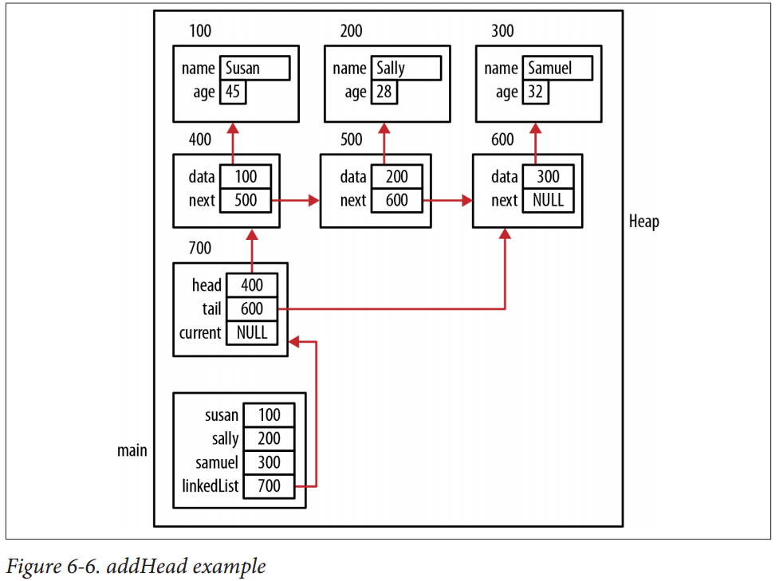

#
## Data Structure

### Using Pointers to Support a Queue

`An empty queue`
<br>NULL is returned
<br>`A single node queue`
<br>Handled by the else if statement
<br>`A multiple node queue`
<br>Handled by the else clause

In the latter case, the tmp pointer is advanced node by node until it points to the node
immediately preceding the tail node. Three operations are then performed in the fol‐
lowing sequence:
<br>1. The tail is assigned to the tmp node
<br>2. The tmp pointer is advanced to the next node
<br>3. The tail’s next field is set to NULL to indicate there are no more nodes in the queue




```c
typedef LinkedList Queue;

void
initializeQueue(Queue* queue)
{
    initializeList(queue);
}

void
enqueue(Queue* queue, void* node)
{
    addHead(queue, node);
}

void*
dequeue(Queue* queue)
{
    Node* tmp = queue->head;
    void* data;
    if (queue->head == NULL)
        data = NULL;
    else if (queue->head == queue->tail) {
        queue->head = queue->tail = NULL;
        data = tmp->data;
        free(tmp);
    } else {
        while (tmp->next != queue->tail)
            tmp = tmp->next;
        queue->tail = tmp;
        tmp = tmp->next;
        queue->tail->next = NULL;
        data = tmp->data;
        free(tmp);
    }
    return data;
}

void
main(void)
{
    Queue queue;
    initializeQueue(&queue);
    enqueue(&queue, samuel);
    enqueue(&queue, sally);
    enqueue(&queue, susan);
    void* data = dequeue(&queue);
    printf("Dequeued %s\n", ((Employee*) data)->name);
    data = dequeue(&queue);
    printf("Dequeued %s\n", ((Employee*) data)->name);
    data = dequeue(&queue);
    printf("Dequeued %s\n", ((Employee*) data)->name);
    /*
    The output of this sequence follows:
    Dequeued Samuel
    Dequeued Sally
    Dequeued Susan
    */
}
```

+ Modified

```c
typedef struct _node_t{
    void* data;
    struct _node_t* next;
} node_t;

typedef struct _queue_t {
    node_t* head;
    node_t* tail;
} queue_t;

void*
queue_create(void)
{
    queue_t* queue = (queue_t*)malloc(sizeof(queue_t));
    if (queue) {
        queue->head = NULL;
        queue->tail = NULL;
    }
    return ((queue)? queue: NULL);
}

int
queue_enqueue(void* queue, void* data)
{
    int iret = 0;
    queue_t* qtmp = NULL;
    node_t* node = NULL;
    if (!queue || !data) {
        iret = -1;
        goto exit;
    }
    qtmp = (queue_t*)queue;
    node = (node_t*)malloc(sizeof(node_t));
    node->data = data;
    if (qtmp->head == NULL) {
        qtmp->tail = node;
        node->next = NULL;
    } else
        node->next = qtmp->head;
    qtmp->head = node;
exit:
    return iret;
}

int
queue_dequeue(void* queue, void** data)
{
    int iret = 0;
    queue_t* qtmp = NULL;
    node_t* nodetmp = NULL;
    if (!queue) {
        iret = -1;
        goto exit;
    }
    qtmp = (queue_t*)queue;
    nodetmp = qtmp->head;
    if (qtmp->head == NULL)
        *data = NULL;
    else if (qtmp->head == qtmp->tail) {
        qtmp->head = qtmp->tail = NULL;
        *data = nodetmp->data;
        free(nodetmp);
    } else {
        while (nodetmp->next != qtmp->tail)
            nodetmp = nodetmp->next;
        qtmp->tail = nodetmp;
        nodetmp = nodetmp->next;
        qtmp->tail->next = NULL;
        *data = nodetmp->data;
        free(nodetmp);
    }
exit:
    return (*data)? 1: 0;
}

void
main(void)
{
    int loop = 100;
    void* queue = queue_create();
    int *penq = NULL;
    int *pdeq = NULL;
    for(; loop != 0; loop--) {
        penq = (int*)malloc(sizeof(int));
        *penq = loop;
        printf("enqueue: addr(%p):num(%d)\n", penq, *penq);
        queue_enqueue(queue, penq);
    }
    while(queue_dequeue(queue, (void**)&pdeq)) {
        printf("dequeue: addr(%p):num(%d)\n", pdeq, *pdeq);
        free(pdeq);
        pdeq = NULL;
    }
}
```

### Using Pointers to Support Linked List





In the `addHead` function listed below, memory is first allocated for the node and the data
passed to the function is assigned to the structure’s data field. By passing the data as a
pointer to void, the linked list is able to hold any type of data the user wants to use.

Next, we check to see whether the linked list is empty. If so, we assign the tail pointer to
the node and assign NULL to the node’s next field. If not, the node’s next pointer is
assigned to the list’s head. Regardless, the list’s head is assigned to the node

The `addTail` function is shown below. It starts by allocating memory for a new node
and assigning the data to the data field. Since the node will always be added to the tail,
the node’s next field is assigned to NULL. If the linked list is empty, then the head pointer
will be NULL and head can be assigned to the new node. If it is not NULL, then the tail’s
next pointer is assigned to the new node. Regardless, the linked list’s tail pointer is
assigned to the node

```c
typedef struct _employee {
    char name[32];
    unsigned char age;
} Employee;

typedef struct _node {
    void* data;
    struct _node* next;
} Node;

typedef struct _linkedList {
    Node* head;
    Node* tail;
    Node* current;
} LinkedList;

typedef void(*DISPLAY)(void*);
typedef int(*COMPARE)(void*, void*);

void initializeList(LinkedList*);   //Initializes the linked list
void addHead(LinkedList*, void*);   //Adds data to the linked list’s head
void addTail(LinkedList*, void*);   //Adds data to the linked list’s tail
void delete (LinkedList*, Node*);   //Removes a node from the linked list
Node* getNode(LinkedList*, COMPARE, void*); //Returns a pointer to the node containing a specific data item
void displayLinkedList(LinkedList*, DISPLAY); //Displays the linked list

int
compareEmployee(Employee* e1, Employee* e2)
{
    return strcmp(e1->name, e2->name);
}

void
displayEmployee(Employee* employee)
{
    printf("%s\t%d\n", employee->name, employee->age);
}

void
initializeList(LinkedList* list)
{
    list->head = NULL;
    list->tail = NULL;
    list->current = NULL;
}

void
addHead(LinkedList* list, void* data)
{
    Node* node = (Node*) malloc(sizeof(Node));
    node->data = data;
    if (list->head == NULL) {
        list->tail = node;
        node->next = NULL;
    } else
        node->next = list->head;
    list->head = node;
}

void
addTail(LinkedList* list, void* data)
{
    Node* node = (Node*) malloc(sizeof(Node));
    node->data = data;
    node->next = NULL;
    if (list->head == NULL)
        list->head = node;
    else
        list->tail->next = node;
    list->tail = node;
}

Node*
getNode(LinkedList* list, COMPARE compare, void* data)
{
    Node* node = list->head;
    while (node != NULL) {
        if (compare(node->data, data) == 0)
            return node;
        node = node->next;
    }
    return NULL;
}

void
delete(LinkedList* list, Node* node)
{
    if (node == list->head) {
        if (list->head->next == NULL)
            list->head = list->tail = NULL;
        else
            list->head = list->head->next;
    } else {
        Node* tmp = list->head;
        while (tmp != NULL && tmp->next != node)
            tmp = tmp->next;
        if (tmp != NULL)
            tmp->next = node->next;
    }
    free(node);
}

void
displayLinkedList(LinkedList* list, DISPLAY display)
{
    printf(" \nLinked List\n" );
    Node* current = list->head;
    while (current != NULL) {
        display(current->data);
        current = current->next;
    }
}

void
main(void)
{
    LinkedList linkedList;
    Employee* samuel = (Employee*) malloc(sizeof(Employee));
    strcpy(samuel->name, "Samuel" );
    samuel->age = 32;
    Employee* sally = (Employee*) malloc(sizeof(Employee));
    strcpy(sally->name, "Sally" );
    sally->age = 28;
    Employee* susan = (Employee*) malloc(sizeof(Employee));
    strcpy(susan->name, "Susan" );
    susan->age = 45;
    initializeList(&linkedList);
    addHead(&linkedList, samuel);
    addHead(&linkedList, sally);
    addHead(&linkedList, susan);
    addTail(&linkedList, susan);
    addTail(&linkedList, sally);
    addTail(&linkedList, samuel);
    displayLinkedList(&linkedList, (DISPLAY)displayEmployee);
    /*
        The output of this sequence follows:
        Linked List
        Susan 45
        Sally 28
        Samuel 32
    */
    /*perform comparisons*/
    Node* node = getNode(&linkedList,
            (int (*)(void*, void*))compareEmployee, sally);
    delete (&linkedList, node);
}
```
