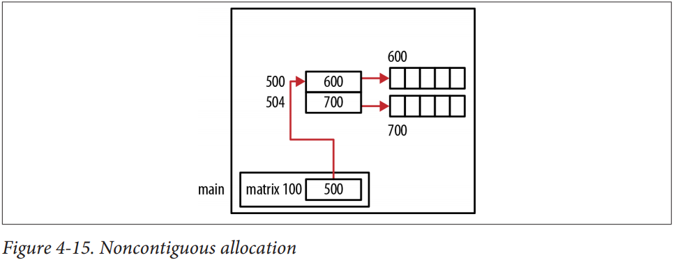

#
## Data Structure

### Sort

+ Conversion of Infix Expressions to Prefix and Postfix

Infix to Postfix
<br>

<br>
Infix to prefix
<br>

<br>
Infix to prefix and postfix
<br>

<br>
How to work in statck
<br>


[reference.stack](http://interactivepython.org/runestone/static/pythonds/BasicDS/InfixPrefixandPostfixExpressions.html)
[reference.C Operator Precedence](https://en.cppreference.com/w/c/language/operator_precedence)
<br>

+ [Stack | Set 2 (Infix to Postfix)](https://www.geeksforgeeks.org/stack-set-2-infix-to-postfix/)

```c
// C program to convert infix expression to postfix
#include <stdio.h>
#include <string.h>
#include <stdlib.h>

// Stack type
struct Stack
{
	int top;
	unsigned capacity;
	int* array;
};

// Stack Operations
struct Stack* createStack( unsigned capacity )
{
	struct Stack* stack = (struct Stack*) malloc(sizeof(struct Stack));

	if (!stack)
		return NULL;

	stack->top = -1;
	stack->capacity = capacity;

	stack->array = (int*) malloc(stack->capacity * sizeof(int));

	if (!stack->array)
		return NULL;
	return stack;
}
int isEmpty(struct Stack* stack)
{
	return stack->top == -1 ;
}
char peek(struct Stack* stack)
{
	return stack->array[stack->top];
}
char pop(struct Stack* stack)
{
	if (!isEmpty(stack))
		return stack->array[stack->top--] ;
	return '$';
}
void push(struct Stack* stack, char op)
{
	stack->array[++stack->top] = op;
}


// A utility function to check if the given character is operand
int isOperand(char ch)
{
	return (ch >= 'a' && ch <= 'z') || (ch >= 'A' && ch <= 'Z');
}

// A utility function to return precedence of a given operator
// Higher returned value means higher precedence
int Prec(char ch)
{
	switch (ch)
	{
	case '+':
	case '-':
		return 1;

	case '*':
	case '/':
		return 2;

	case '^':
		return 3;
	}
	return -1;
}


// The main function that converts given infix expression
// to postfix expression.
int infixToPostfix(char* exp)
{
	int i, k;

	// Create a stack of capacity equal to expression size
	struct Stack* stack = createStack(strlen(exp));
	if(!stack) // See if stack was created successfully
		return -1 ;

	for (i = 0, k = -1; exp[i]; ++i)
	{
		// If the scanned character is an operand, add it to output.
		if (isOperand(exp[i]))
			exp[++k] = exp[i];

		// If the scanned character is an ‘(‘, push it to the stack.
		else if (exp[i] == '(')
			push(stack, exp[i]);

		// If the scanned character is an ‘)’, pop and output from the stack
		// until an ‘(‘ is encountered.
		else if (exp[i] == ')')
		{
			while (!isEmpty(stack) && peek(stack) != '(')
				exp[++k] = pop(stack);
			if (!isEmpty(stack) && peek(stack) != '(')
				return -1; // invalid expression
			else
				pop(stack);
		}
		else // an operator is encountered
		{
			while (!isEmpty(stack) && Prec(exp[i]) <= Prec(peek(stack)))
				exp[++k] = pop(stack);
			push(stack, exp[i]);
		}

	}

	// pop all the operators from the stack
	while (!isEmpty(stack))
		exp[++k] = pop(stack );

	exp[++k] = '\0';
	printf( "%sn", exp );
}

// Driver program to test above functions
int main()
{
	char exp[] = "a+b*(c^d-e)^(f+g*h)-i";
	infixToPostfix(exp);
	return 0;
}
```

+ [insertion sort](https://www.geeksforgeeks.org/insertion-sort/)

```c
void insertionSort(int arr[], int n)
{
    int i, key, j;
    for (i = 1; i < n; i++) {
        key = arr[i];
        j = i-1;
        /* Move elements of arr[0..i-1], that are
           greater than key, to one position ahead
           of their current position */
        while (j >= 0 && arr[j] > key) {
            arr[j+1] = arr[j];
            j = j-1;
        }
        arr[j+1] = key;
    }
}
```

+ [Radix Sort](https://www.geeksforgeeks.org/radix-sort/)

```c
// C++ implementation of Radix Sort
#include<iostream>
using namespace std;

// A utility function to get maximum value in arr[]
int getMax(int arr[], int n)
{
	int mx = arr[0];
	for (int i = 1; i < n; i++)
		if (arr[i] > mx)
			mx = arr[i];
	return mx;
}

// A function to do counting sort of arr[] according to
// the digit represented by exp.
void countSort(int arr[], int n, int exp)
{
	int output[n]; // output array
	int i, count[10] = {0};

	// Store count of occurrences in count[]
	for (i = 0; i < n; i++)
		count[ (arr[i]/exp)%10 ]++;

	// Change count[i] so that count[i] now contains actual
	// position of this digit in output[]
	for (i = 1; i < 10; i++)
		count[i] += count[i - 1];

	// Build the output array
	for (i = n - 1; i >= 0; i--)
	{
		output[count[ (arr[i]/exp)%10 ] - 1] = arr[i];
		count[ (arr[i]/exp)%10 ]--;
	}

	// Copy the output array to arr[], so that arr[] now
	// contains sorted numbers according to current digit
	for (i = 0; i < n; i++)
		arr[i] = output[i];
}

// The main function to that sorts arr[] of size n using
// Radix Sort
void radixsort(int arr[], int n)
{
	// Find the maximum number to know number of digits
	int m = getMax(arr, n);

	// Do counting sort for every digit. Note that instead
	// of passing digit number, exp is passed. exp is 10^i
	// where i is current digit number
	for (int exp = 1; m/exp > 0; exp *= 10)
		countSort(arr, n, exp);
}

// A utility function to print an array
void print(int arr[], int n)
{
	for (int i = 0; i < n; i++)
		cout << arr[i] << " ";
}

// Driver program to test above functions
int main()
{
	int arr[] = {170, 45, 75, 90, 802, 24, 2, 66};
	int n = sizeof(arr)/sizeof(arr[0]);
	radixsort(arr, n);
	print(arr, n);
	return 0;
}
```

### Array

+ One Dimesion Array

A(0: u-1)

```text
Get A(i) address, A(i) = lo + i * d
lo: start address of array
i: index
d: size of data

if arrary is A(t:u), and A(i)=lo + (i-t)*d
```

+ Two Dimensions Array

A[0: u1-1, 0:u2-1], [Reference 2D array](https://www.dyclassroom.com/c/c-pointers-and-two-dimensional-array)

```text
As Row:
Get A(i, j) address, A(i, j) = lo + i*u2d + j*d = lo + (i*u2 + j)*d

As Column:
Get A(i, j) address, A(i, i) = lo + j*u1*d + i*d = lo + (j*u1 + i)*d
```

A(l1:u1, l2:u2)

```text
As Row:
Get A(i, j) address, A(i, j) = lo + (i-l1)*n*d + (j-l2)*d
n = u2-l2+1;

As Column:
Get A(i, j) address, A(i, i) = lo + (j-l2)*m*d + (i-l1)*d
m = u1-l1+1
```

```c
/*Passing a Multidimensional Array*/
void display2DArrayUnknownSizePtrPtr(int** arr, int rows, int cols) {
    for(int i=0; i<rows; i++)
        for(int j=0; j<cols; j++)
            printf("%d ", *(*arr + i*cols + j));
    printf("\n");
}

void display2DArrayUnknownSizePtr(int* arr, int rows, int cols) {
    for(int i=0; i<rows; i++)
        for(int j=0; j<cols; j++)
            printf("%d ", *(arr + (i*cols) + j));
    printf("\n");
}

void main() {
    int matrix[2][5] = {
        {1, 2, 3, 4, 5},
        {6, 7, 8, 9, 10}
    };
    int* pa = matrix;
    display2DArrayUnknownSizePtrPtr(&pa, 2, 5);
    display2DArrayUnknownSizePtr(matrix, 2, 5);
}
```

+ Dynamically Allocating a Two-Dimensional Array

Allocating Potentially Noncontiguous Memory



```c
/*Allocating Potentially Noncontiguous Memory*/
void main()
{
    int rows = 2;
    int columns = 5;
    int **matrix = (int **)malloc(rows * sizeof(int *));
    for (int i = 0; i < rows; i++) {
        matrix[i] = (int *)malloc(columns * sizeof(int));
    }
    for(int i=0; i<rows; i++)
        for(int j=0; j<columns; j++)
            matrix[i][j] = j;
    for(int i=0; i<rows; i++)
        for(int j=0; j<columns; j++)
            printf("%d ", matrix[i][j]);
}
```

Allocating Contiguous Memory


```c
int rows = 2;
int columns = 5;
int **matrix = (int **)malloc(rows * sizeof(int *));
matrix[0] = (int *) malloc(rows * columns * sizeof(int));
for (int i = 1; i < rows; i++)
    matrix[i] = matrix[0] + i * columns;
```

+ Three Dimesion Array

```text
TODO
```

### Using Pointers to Support a Queue

```c
typedef struct _node_t{
    void* data;
    struct _node_t* next;
} node_t;

typedef struct _queue_t {
    node_t* head;
    node_t* tail;
} queue_t;

void*
queue_create(void)
{
    queue_t* queue = (queue_t*)malloc(sizeof(queue_t));
    if (queue) {
        queue->head = NULL;
        queue->tail = NULL;
    }
    return ((queue)? queue: NULL);
}

int
queue_enqueue(void* queue, void* data)
{
    int iret = 0;
    queue_t* qtmp = NULL;
    node_t* node = NULL;
    if (!queue || !data) {
        iret = -1;
        goto exit;
    }
    qtmp = (queue_t*)queue;
    node = (node_t*)malloc(sizeof(node_t));
    node->data = data;
    if (qtmp->head == NULL) {
        qtmp->tail = node;
        node->next = NULL;
    } else
        node->next = qtmp->head;
    qtmp->head = node;
exit:
    return iret;
}

int
queue_dequeue(void* queue, void** data)
{
    int iret = 0;
    queue_t* qtmp = NULL;
    node_t* nodetmp = NULL;
    if (!queue) {
        iret = -1;
        goto exit;
    }
    qtmp = (queue_t*)queue;
    nodetmp = qtmp->head;
    if (qtmp->head == NULL)
        *data = NULL;
    else if (qtmp->head == qtmp->tail) {
        qtmp->head = qtmp->tail = NULL;
        *data = nodetmp->data;
        free(nodetmp);
    } else {
        while (nodetmp->next != qtmp->tail)
            nodetmp = nodetmp->next;
        qtmp->tail = nodetmp;
        nodetmp = nodetmp->next;
        qtmp->tail->next = NULL;
        *data = nodetmp->data;
        free(nodetmp);
    }
exit:
    return (*data)? 1: 0;
}

static int
apgnssinfo_dequeue(struct algocfg_apgnssinfo_t **gnssinfo)
{
    queue_dequeue(mgnssque, (void**)gnssinfo);
    if (!*gnssinfo)
        return STATE_UNAVAILABLE;
    printf("GNSS TAKE %lld %lld ",
            (uint64_t)((*gnssinfo)->latitude*1000000),
            (uint64_t)((*gnssinfo)->longitude*1000000));
    return STATE_AVAILABLE;
}

void
main(void)
{
    int loop = 100;
    void* queue = queue_create();
    int *penq = NULL;
    int *pdeq = NULL;
    for(; loop != 0; loop--) {
        penq = (int*)malloc(sizeof(int));
        *penq = loop;
        printf("enqueue: addr(%p):num(%d)\n", penq, *penq);
        queue_enqueue(queue, penq);
    }
    while(queue_dequeue(queue, (void**)&pdeq)) {
        printf("dequeue: addr(%p):num(%d)\n", pdeq, *pdeq);
        free(pdeq);
        pdeq = NULL;
    }
}
```

`An empty queue`
<br>NULL is returned
<br>`A single node queue`
<br>Handled by the else if statement
<br>`A multiple node queue`
<br>Handled by the else clause

In the latter case, the tmp pointer is advanced node by node until it points to the node
immediately preceding the tail node. Three operations are then performed in the fol‐
lowing sequence:
<br>1. The tail is assigned to the tmp node
<br>2. The tmp pointer is advanced to the next node
<br>3. The tail’s next field is set to NULL to indicate there are no more nodes in the queue


### Using Pointers to Support Linked List

```c
typedef struct _node_t {
    void* data;
    struct _node_t* next;
} node_t;

typedef struct _datalist_t {
    node_t* head;
    node_t* tail;
} datalist_t;

typedef int(*fcompare)(void*, void*);
typedef int(*fgothrough)(void*);

void*
datalist_create(void)
{
    datalist_t* list = (datalist_t*)portmemalloc(sizeof(datalist_t));
    if (list) {
        list->head = NULL;
        list->tail = NULL;
    }
    return ((list)? list: NULL);
}

int
datalist_addhead(void* chain, void* data)
{
    int iret = STATE_AVAILABLE;
    node_t* node = NULL;
    datalist_t* list = (datalist_t*)chain;
    if (!list || !data) {
        iret = -1;
        goto exit;
    }
    node = (node_t*)portmemalloc(sizeof(node_t));
    if (!node) {
        iret = -2;
        goto exit;
    }
    node->data = data;
    if (!list->head) {
        list->tail = node;
        node->next = NULL;
    } else
        node->next = list->head;
    list->head = node;
exit:
    if (!IS_AVAILABLE(iret))
        ALOGE("%s,l:%d,err:%d\n", __FUNCTION__, __LINE__, iret);
    return IS_AVAILABLE(iret);
}

int
datalist_addtail(void* chain, void* data)
{
    int iret = STATE_AVAILABLE;
    node_t* node = NULL;
    datalist_t* list = (datalist_t*)chain;
    if (!list || !data) {
        iret = -1;
        goto exit;
    }
    node = (node_t*)portmemalloc(sizeof(node_t));
    if (!node) {
        iret = -2;
        goto exit;
    }
    node->data = data;
    node->next = NULL;
    if (!list->head)
        list->head = node;
    else
        list->tail->next = node;
    list->tail = node;
exit:
    if (!IS_AVAILABLE(iret))
        ALOGE("%s,l:%d,err:%d\n", __FUNCTION__, __LINE__, iret);
    return IS_AVAILABLE(iret);
}

void*
datalist_getnode(void* chain, fcompare callback, void* data)
{
    int iret = STATE_AVAILABLE;
    datalist_t* list = (datalist_t*)chain;;
    node_t* node = NULL;
    if (!list || !callback || !data) {
        iret = -1;
        goto exit;
    }
    node = list->head;
    while (node) {
        if (callback(node->data, data))
            return node;
        node = node->next;
    }
exit:
    if (!IS_AVAILABLE(iret))
        ALOGE("%s,l:%d,err:%d\n", __FUNCTION__, __LINE__, iret);
    return NULL;
}

void*
datalist_getnodedata(void* node)
{
    int iret = STATE_AVAILABLE;
    node_t* pnode = (node_t*)node;;
    if (!pnode) {
        iret = -1;
        goto exit;
    }
    return pnode->data;
exit:
    if (!IS_AVAILABLE(iret))
        ALOGE("%s,l:%d,err:%d\n", __FUNCTION__, __LINE__, iret);
    return NULL;
}

int
datalist_deletenode(void* chain, void* data)
{
    int iret = STATE_AVAILABLE;
    datalist_t* list = (datalist_t*)chain;
    node_t* node = NULL;
    if (!list || !data) {
        iret = -1;
        goto exit;
    }
    node = (node_t*)data;
    if (node == list->head) {
        if (!list->head->next)
            list->head = list->tail = NULL;
        else
            list->head = list->head->next;
    } else {
        node_t* nodetmp = list->head;
        while (nodetmp && nodetmp->next != node)
            nodetmp = nodetmp->next;
        if (nodetmp)
            nodetmp->next = node->next;
    }
    portmemfree(node);
exit:
    if (!IS_AVAILABLE(iret))
        ALOGE("%s,l:%d,err:%d\n", __FUNCTION__, __LINE__, iret);
    return IS_AVAILABLE(iret);
}

int
datalist_gothrough(void* chain, fgothrough callback)
{
    int iret = STATE_AVAILABLE;
    datalist_t* list = (datalist_t*)chain;
    node_t* current = NULL;
    if (!list || !callback) {
        iret = -1;
        goto exit;
    }
    current = list->head;
    while (current) {
        callback(current->data);
        current = current->next;
    }
exit:
    if (!IS_AVAILABLE(iret))
        ALOGE("%s,l:%d,err:%d\n", __FUNCTION__, __LINE__, iret);
    return IS_AVAILABLE(iret);
}

typedef struct _attributenode {
    int tag_num;
    int (*fptr)(void*);
} attributenode_t;

int
test1(void* data)
{
    printf("%s\n", __FUNCTION__);
    return 0;
}

int
test2(void* data)
{
    printf("%s\n", __FUNCTION__);
    return 0;
}

int
test3(void* data)
{
    printf("%s\n", __FUNCTION__);
    return 0;
}

int
gothrough(void* data)
{
    int iret = STATE_AVAILABLE;
    attributenode_t* ptr = NULL;
    if (!data) {
        iret = -1;
        goto exit;
    }
    ptr = (attributenode_t*)data;
    ptr->fptr(NULL);
exit:
    if (!IS_AVAILABLE(iret))
        ALOGE("%s,l:%d,err:%d\n", __FUNCTION__, __LINE__, iret);
    return IS_AVAILABLE(iret);
}

int
compare_attribute(void* e1, void* e2)
{
    int iret = STATE_UNAVAILABLE;
    attributenode_t* ptr1 = NULL;
    attributenode_t* ptr2 = NULL;
    if (!e1 || !e2) {
        iret = -1;
        goto exit;
    }
    ptr1 = (attributenode_t*)e1;
    ptr2 = (attributenode_t*)e2;
    iret = (ptr1->tag_num == ptr2->tag_num)? STATE_AVAILABLE: STATE_UNAVAILABLE;
exit:
    return IS_AVAILABLE(iret);
}

void
main(void)
{
    void* list = datalist_create();
    void* node = NULL;
    attributenode_t* attri_1 = (attributenode_t*)portmemalloc(sizeof(attributenode_t));
    attributenode_t* attri_2 = (attributenode_t*)portmemalloc(sizeof(attributenode_t));
    attributenode_t* attri_3 = (attributenode_t*)portmemalloc(sizeof(attributenode_t));
    char name[24];

    strcpy(name, "1234");
    printf("%s", name);

    attri_1->tag_num = 1;
    attri_1->fptr = &test1;
    datalist_addhead(list, attri_1);

    attri_2->tag_num = 2;
    attri_2->fptr = &test2;
    datalist_addhead(list, attri_2);

    attri_3->tag_num = 3;
    attri_3->fptr = &test3;
    datalist_addhead(list, attri_3);

    ALOGD("gothroug 1\n");
    datalist_gothrough(list, gothrough);

    node = datalist_getnode(list, compare_attribute, attri_2);
    if (node)
        datalist_deletenode(list, node);

    ALOGD("gothroug 2\n");
    datalist_gothrough(list, gothrough);
}
```


In the `addHead` function listed below, memory is first allocated for the node and the data
passed to the function is assigned to the structure’s data field. By passing the data as a
pointer to void, the linked list is able to hold any type of data the user wants to use.

Next, we check to see whether the linked list is empty. If so, we assign the tail pointer to
the node and assign NULL to the node’s next field. If not, the node’s next pointer is
assigned to the list’s head. Regardless, the list’s head is assigned to the node

The `addTail` function is shown below. It starts by allocating memory for a new node
and assigning the data to the data field. Since the node will always be added to the tail,
the node’s next field is assigned to NULL. If the linked list is empty, then the head pointer
will be NULL and head can be assigned to the new node. If it is not NULL, then the tail’s
next pointer is assigned to the new node. Regardless, the linked list’s tail pointer is
assigned to the node


<!---
```c
typedef struct _employee {
    char name[32];
    unsigned char age;
} Employee;

typedef struct _node {
    void* data;
    struct _node* next;
} Node;

typedef struct _linkedList {
    Node* head;
    Node* tail;
    Node* current;
} LinkedList;

typedef void(*DISPLAY)(void*);
typedef int(*COMPARE)(void*, void*);

void initializeList(LinkedList*);   //Initializes the linked list
void addHead(LinkedList*, void*);   //Adds data to the linked list’s head
void addTail(LinkedList*, void*);   //Adds data to the linked list’s tail
void delete (LinkedList*, Node*);   //Removes a node from the linked list
Node* getNode(LinkedList*, COMPARE, void*); //Returns a pointer to the node containing a specific data item
void displayLinkedList(LinkedList*, DISPLAY); //Displays the linked list

int
compareEmployee(Employee* e1, Employee* e2)
{
    return strcmp(e1->name, e2->name);
}

void
displayEmployee(Employee* employee)
{
    printf("%s\t%d\n", employee->name, employee->age);
}

void
initializeList(LinkedList* list)
{
    list->head = NULL;
    list->tail = NULL;
    list->current = NULL;
}

void
addHead(LinkedList* list, void* data)
{
    Node* node = (Node*) malloc(sizeof(Node));
    node->data = data;
    if (list->head == NULL) {
        list->tail = node;
        node->next = NULL;
    } else
        node->next = list->head;
    list->head = node;
}

void
addTail(LinkedList* list, void* data)
{
    Node* node = (Node*) malloc(sizeof(Node));
    node->data = data;
    node->next = NULL;
    if (list->head == NULL)
        list->head = node;
    else
        list->tail->next = node;
    list->tail = node;
}

Node*
getNode(LinkedList* list, COMPARE compare, void* data)
{
    Node* node = list->head;
    while (node != NULL) {
        if (compare(node->data, data) == 0)
            return node;
        node = node->next;
    }
    return NULL;
}

void
delete(LinkedList* list, Node* node)
{
    if (node == list->head) {
        if (list->head->next == NULL)
            list->head = list->tail = NULL;
        else
            list->head = list->head->next;
    } else {
        Node* tmp = list->head;
        while (tmp != NULL && tmp->next != node)
            tmp = tmp->next;
        if (tmp != NULL)
            tmp->next = node->next;
    }
    free(node);
}

void
displayLinkedList(LinkedList* list, DISPLAY display)
{
    printf(" \nLinked List\n" );
    Node* current = list->head;
    while (current != NULL) {
        display(current->data);
        current = current->next;
    }
}

void
main(void)
{
    LinkedList linkedList;
    Employee* samuel = (Employee*) malloc(sizeof(Employee));
    strcpy(samuel->name, "Samuel" );
    samuel->age = 32;
    Employee* sally = (Employee*) malloc(sizeof(Employee));
    strcpy(sally->name, "Sally" );
    sally->age = 28;
    Employee* susan = (Employee*) malloc(sizeof(Employee));
    strcpy(susan->name, "Susan" );
    susan->age = 45;
    initializeList(&linkedList);
    addHead(&linkedList, samuel);
    addHead(&linkedList, sally);
    addHead(&linkedList, susan);
    addTail(&linkedList, susan);
    addTail(&linkedList, sally);
    addTail(&linkedList, samuel);
    displayLinkedList(&linkedList, (DISPLAY)displayEmployee);
    /*
        The output of this sequence follows:
        Linked List
        Susan 45
        Sally 28
        Samuel 32
    */
    /*perform comparisons*/
    Node* node = getNode(&linkedList,
            (int (*)(void*, void*))compareEmployee, sally);
    delete (&linkedList, node);
}
```
-->

## Question

+ [Data Structure Using C 1.3.1.a](https://www.geeksforgeeks.org/sum-of-the-series-1-12-123-1234-1234-n/)

```c
for (i = 1; i <= n; i++)
    for(j = i; j <=n; j++)
        for (k = j; k <=n; k++)
            x++;    // x = ?
```
n = 3
i = (1,2,3)
j = ((1,2,3), (2,3), (4))
k = (((1,2,3), (2,3), (3)), ((2,3), (3)), (3))
x = (3+2+1)+(2+1)+1
x=10


