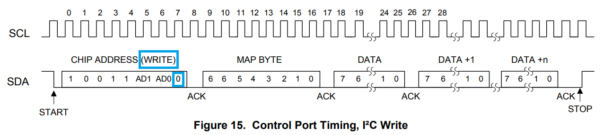
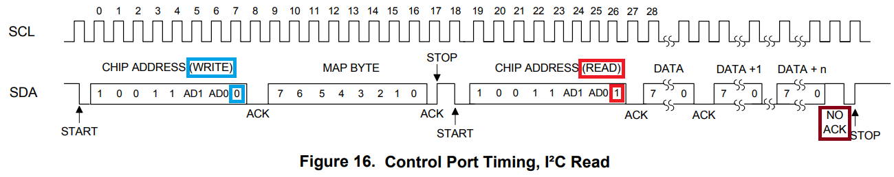

##
### Inter-Integrated Circuit, I2C

+ Start and Stop Condition


+ Case 1

If the master only writes to the slave device then the data transfer direction is not changed.


+ Case 2

If the master only needs to read from the slave device then it simply sends the I2C address with the
R/W bit set to read. After this the master device starts reading the data.


+ Case 3

Sometimes the master needs to write some data and then read from the slave device. In such cases it
must first write to the slave device, change the data transfer direction and then read the device.
This means sending the I2C address with the R/W bit set to write and then sending some additional
data like register address. After writing is finished the master device generates repeated start
condition and sends the I2C address with the R/W bit set to read. After this the data transfer
direction is changed and the master device starts reading the data.


+ CS5346 Control Port Timing, I2C Write



+ CS5346 Control Port Timing, I2C Read



### Serial Peripheral Interface, SPI
<!--* https://en.wikipedia.org/wiki/Serial_Peripheral_Interface-->


```text
# CPOL determines the polarity of the clock. The polarities can be converted with a simple inverter.

    1. CPOL=0 is a clock which idles at 0, and each cycle consists of a pulse of 1. That is, the leading
    edge is a rising edge, and the trailing edge is a falling edge.

    2. CPOL=1 is a clock which idles at 1, and each cycle consists of a pulse of 0. That is, the leading
    edge is a falling edge, and the trailing edge is a rising edge.
```
```text
# CPHA determines the timing of the data bits relative to the clock pulses.
It is not trivial to convert between the two forms.

    1. For CPHA=0, the "out" side changes the data on the trailing edge of the preceding clock cycle,
    while the "in" side captures the data on (or shortly after) the leading edge of the clock cycle.
    The out side holds the data valid until the trailing edge of the current clock cycle. For the
    first cycle, the first bit must be on the MOSI line before the leading clock edge.

    2. An alternative way of considering it is to say that a CPHA=0 cycle consists of a half cycle with the
    clock idle, followed by a half cycle with the clock asserted.

    3. For CPHA=1, the "out" side changes the data on the leading edge of the current clock cycle, while
    the "in" side captures the data on (or shortly after) the trailing edge of the clock cycle. The out
    side holds the data valid until the leading edge of the following clock cycle. For the last cycle,
    the slave holds the MISO line valid until slave select is deasserted.

    4. An alternative way of considering it is to say that a CPHA=1 cycle consists of a half cycle with the
    clock asserted, followed by a half cycle with the clock idle.
```
