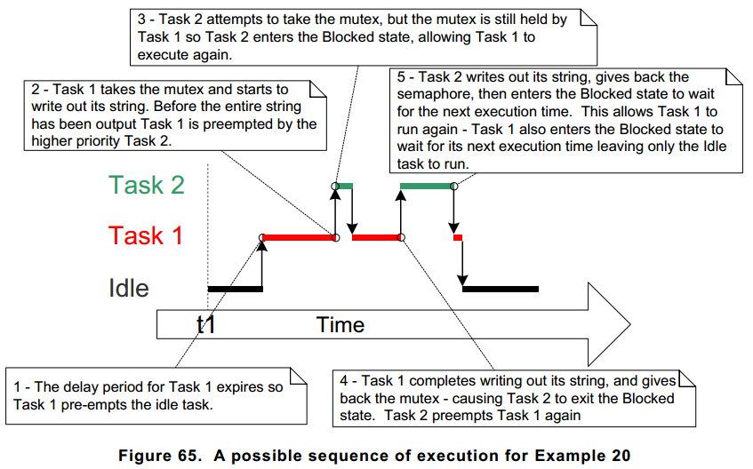
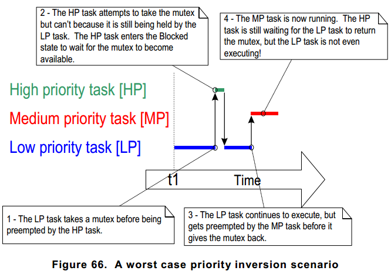
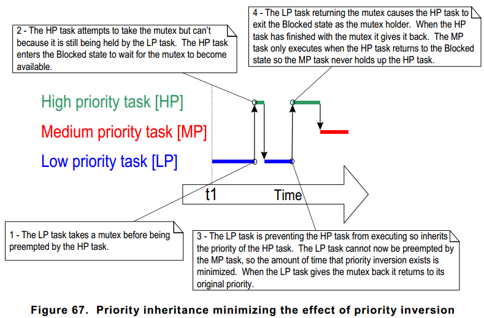

#

## FreeRTOS
### Task Scheduling Algorithms
<!--- limiation line
<br>---------------20------------------40-----------------60------------------80--------------
-->

Tasks that are in the Ready state are available to be selected by
the scheduler as the task to enter the Running state. The scheduler
will always choose the `highest priority Ready state task` to enter
the Running state.

Tasks can wait in the Blocked state `for an event` and are automatically
moved back to the Ready state when the event occurs.
For example:
<br> 1. when `a block time expires`, and are normally used to implement `periodic` or `timeout`
behavior.
<br> 2. Synchronization events occur when a task or `interrupt service routine` sends information 
using a task notification, `queue`, `event group`, or one of the many types of `semaphore`. 
They are generally used to signal asynchronous activity, such as data arriving at a peripheral.

The algorithm can be changed using the `configUSE_PREEMPTION` and `configUSE_TIME_SLICING`
configuration constants. Both constants are defined in `FreeRTOSConfig.h`.

A third configuration constant, `configUSE_TICKLESS_IDLE` is described in Chapter 10,
`Low Power Support`.

+ Fixed Priority

Scheduling algorithms described as `Fixed Priority` do not change the priority
assigned to the tasks being scheduled, but also do not prevent the tasks
themselves from changing their own priority, or that of other tasks.

+ Pre-emptive

Pre-emptive scheduling algorithms will immediately `pre-empt` the Running
state task if a task that has a priority higher than the Running state task
enters the Ready state. Being pre-empted means being involuntarily (without
explicitly yielding or blocking) moved out of the Running state and into the
Ready state to allow a different task to enter the Running state.

+ Time Slicing

Time slicing is used to `share processing time` between tasks of equal priority,
even when the tasks do not explicitly yield or enter the Blocked state.
Scheduling algorithms described as using `Time Slicing` will select a new task
to enter the Running state at the end of each time slice if there are other
Ready state tasks that have the same priority as the Running task. A time
slice is equal to the time between two RTOS tick interrupts.

#### Tasks have a unique priority

configUSE_PREEMPTION 1
<br>configUSE_TIME_SLICING 1


#### 2 Tasks share a priority

configUSE_PREEMPTION 1
<br>configUSE_TIME_SLICING 1


#### Prioritized Pre-emptive Scheduling (without Time Slicing)

configUSE_PREEMPTION 1
<br>configUSE_TIME_SLICING 0


### ARM Cortex-M, Interrupts and FreeRTOS

<br> 1. vPortSVCHandler
<br> 2. xPortPendSVHandler
<br> 3. xPortSysTickHandler

## OS
<!--- limiation line
<br>---------------20------------------40-----------------60------------------80--------------
-->

### Resource Management

In a multitasking system there is potential for error if one task starts to access a resource, but
does not complete its access before being transitioned out of the Running state. If the task
leaves the resource in an inconsistent state, then access to the same resource by any other
task or interrupt could result in data corruption, or other similar issue.
<br>
Following are some examples:

+ Accessing Peripherals

Consider the following scenario where two tasks attempt to write to an Liquid Crystal
Display (LCD).
<br>1. Task A executes and starts to write the string "Hello world" to the LCD.
<br>2. Task A is pre-empted by Task B after outputting just the beginning of the string—
"Hello w".
<br>3. Task B writes “Abort, Retry, Fail?” to the LCD before entering the Blocked state.
<br>4. Task A continues from the point at which it was pre-empted, and completes
outputting the remaining characters of its string—"orld".
The LCD now displays the corrupted string "Hello wAbort, Retry, Fail?orld?.

+ Read, Modify, Write Operations

Listing 111 shows a line of C code, and an example of how the C code would typically be
translated into assembly code. It can be seen that the value of PORTA is first read from
memory into a register, modified within the register, and then written back to memory. This
is called a read, modify, write operation.

```c
/* The C code being compiled. */
PORTA |= 0x01;
/* The assembly code produced when the C code is compiled. */
LOAD R1,[#PORTA]    ;Read a value from PORTA into R1
MOVE R2,#0x01       ;Move the absolute constant 1 into R2
OR  R1,R2           ;Bitwise OR R1 (PORTA) with R2 (constant 1)
STORE R1,[#PORTA]   ;Store the new value back to PORTA
```
<br>
This is a `non-atomi` operation because it takes more than one instruction to complete, and
`can be interrupted`. Consider the following scenario where two tasks attempt to update a
memory mapped register called PORTA.
<br>1. Task A loads the value of PORTA into a register—the read portion of the operation.
<br>2. Task A is pre-empted by Task B before it completes the modify and write portions of
the same operation.
<br>3. Task B updates the value of PORTA, then enters the Blocked state.
<br>4. Task A continues from the point at which it was pre-empted. It modifies the copy of
the PORTA value that it already holds in a register, before writing the updated value
back to PORTA.
<br>
In this scenario, Task A updates and writes back an out of date value for PORTA. Task B
modifies PORTA after Task A takes a copy of the PORTA value, and before Task A writes
its modified value back to the PORTA register. When Task A writes to PORTA, it
overwrites the modification that has already been performed by Task B, effectively
`corrupting` the PORTA register value.

#### Critial Section

To ensure data consistency is maintained at all times access to a resource that is shared
between tasks, or between tasks and interrupts, must be managed using a ‘mutual exclusion’
technique. The goal is to ensure that, once a task starts to access a shared resource that is
not re-entrant and not thread-safe, the same task has exclusive access to the resource until
the resource has been returned to a consistent state.

+ Basic Critical Sections
<br>taskENTER_CRITICAL, taskEXIT_CRITICAL(), taskENTER_CRITICAL_FROM_ISR,
taskEXIT_CRITICAL_FROM_ISR.


+ Suspending (or Locking) the Scheduler
<br>vTaskSuspendAll, xTaskResumeAll

+ Mutexes and Binary Semaphores

### Priority Inversion

[ref.1](http://blog.linux.org.tw/~jserv/archives/001299.html), [ref.2](http://wen00072.github.io/blog/2014/03/05/note-priority-inversion-on-mars/)



<br>


<br>
Figure 65 demonstrates one of the potential pitfalls of using a mutex to provide mutual
exclusion. The sequence of execution depicted shows the higher priority Task 2 having to wait
for the lower priority Task 1 to give up control of the mutex. A higher priority task being
delayed by a lower priority task in this manner is called `priority inversion`. This undesirable
behavior would be exaggerated further if a medium priority task started to execute while the
high priority task was waiting for the semaphore—the result would be a high priority task
waiting for a low priority task—without the low priority task even being able to execute. This
worst case scenario is shown in Figure 66.
<br>
Priority inversion can be a significant problem, but in small embedded systems it can often be
avoided at system design time, by considering how resources are accessed.
<br>`Bounded priority inversion`
<br>`高優先權`的process/thread等待進入critical section，該critical section目前由`低優先權`
的process/thread佔用中。因此只要低優先權的process/thread離開該critical section後高優先權的
process/thread便可繼續執行
<br>`Unbounded priority inversion`
<br>`高優先權`的process/thread等待進入critical section，該critical section目前由`低優先權`的
process/thread佔用中`不幸的是`，當`低優先權`process/thread還在critical section執行的時候，被切
換到`中優先權`的process/thread由於`高優先權`的process/thread`被block`, 而`低優先權`的
process/thread一定會被`中優先權`的process/thread搶走執行權。最壞的狀況就是之後就只剩`中優先權`的
process/thread被執行

### Priority Inheritance



<br>
Priority inheritance works by `temporarily raising the priority of the mutex holder` to the priority
of the highest priority task that is attempting to obtain the same mutex. The low priority task that
holds the mutex ‘inherits’ the priority of the task waiting for the mutex. This is demonstrated by
Figure 67. The priority of the mutex holder is reset automatically to its original value when it
gives the mutex back.
<br>
As just seen, priority inheritance functionality effects the priority of tasks that are using the
mutex. For that reason, `mutexes must not be used from an interrupt service routines`.
<br>
當高優先權的process/thread要進入critical section發現該section以被低優先權的process/thread佔用時,
系統`暫時`將該低優先權的process/thread調整到`高優先權`直到該低優先權的process/thread離開critical
section 看來可以解Unbounded priority inversion，bounded priority inversion應該還是本質無法解掉？

### Deadlock

Deadlock occurs when two tasks cannot proceed because they are both waiting for a resource
that is held by the other. Consider the following scenario where Task A and Task B both need
to acquire mutex X and mutex Y in order to perform an action:
<br> 1. Task A executes and successfully takes mutex X.
<br> 2. Task A is pre-empted by Task B.
<br> 3. Task B successfully takes mutex Y before attempting to also take mutex X—but mutex
X is held by Task A so is not available to Task B. Task B opts to enter the Blocked
state to wait for mutex X to be released.
<br> 4. Task A continues executing. It attempts to take mutex Y—but mutex Y is held by Task
B, so is not available to Task A. Task A opts to enter the Blocked state to wait for
mutex Y to be released.
<br>
At the end of this scenario, Task A is waiting for a mutex held by Task B, and Task B is waiting
for a mutex held by Task A. Deadlock has occurred because neither task can proceed.
<br>
As with priority inversion, the best method of avoiding deadlock is to consider its potential at
design time, and design the system to ensure that deadlock cannot occur.<br>In particular, and
as previously stated in this book, it is normally bad practice for a task to wait indefinitely
(without a time out) to obtain a mutex. Instead, `use a time out` that is a little longer than the
maximum time it is expected to have to wait for the mutex—then failure to obtain the mutex
within that time will be a symptom of a design error, which might be a deadlock.
In practice, deadlock is not a big problem in small embedded systems, because the system
designers can have a good understanding of the entire application, and so can identify and
remove the areas where it could occur.


### [spinlock, mutex,semaphore](http://welkinchen.pixnet.net/blog/post/47071066-spinlock-%26-mutex-%26-semaphore-%E7%9A%84%E4%BD%9C%E7%94%A8%E5%92%8C%E5%8D%80%E5%88%A5)

`Mutex`:
<br>是一把鑰匙，一個人拿了就可進入一個房間，出來的時候把鑰匙交給隊列的第一個。一般的用法是
用於串行化對critical section代碼的訪問，保證這段代碼不會被並行的運行。
(A mutex is really a semaphore with value 1.)

<br>`Semaphore`:
<br>是一件可以容納N人的房間，如果人不滿就可以進去，如果人滿了，就要等待有人出來。對於N=1的
情況，稱為binary semaphore。一般的用法是，用於限制對於某一資源的同時訪問。

<br>`Binary semaphore與Mutex的差異`：
<br>在有的系統中Binary semaphore與Mutex是沒有差異的。在有的系統上，主要的差異是`mutex`一定要由`獲得鎖
的進程來釋放`。而`semaphore可以由其它進程釋放`（這時的semaphore實際就是個原子的變量，大家
可以加或減，因此`semaphore可以用於進程間同步`.

Semaphore的同步功能是所有系統都支持的，而Mutex能否由其他進程釋放則未定，因此建議`mutex只用於
保護critical section`。而`semaphore則用於保護某變量，或者同步`。

<br>`spin lock`:
這是一個內核態概念。 spin lock與semaphore的主要區別是`spin lock是busy waiting`, 而`semaphore是sleep`.
對於可以sleep的進程來說，busy waiting當然沒有意義。對於單CPU的系統，busy waiting當然更沒意義
(沒有CPU可以釋放鎖).因此,只有多CPU的內核態`非進程空間`，才會用到spin lock.

<br>Linux kernel的spin lock在非SMP的情況下, 只是關irq,沒有別的操作,用於確保該段程序的運行
不會被打斷.其實也就是`類似mutex`的作用，串行化對critical section的訪問.
但是`mutex不能保護中斷的打斷`，也不能在中斷處理程序中被調用。而`spin lock`也一般沒有必要用於
可以sleep的進程空間。

+ [Mutexes VS Semaphores大揭秘](http://swem.logdown.com/posts/177651-mutexes-and-semaphores-demystified)
<!--- limiation line
<br>---------------20------------------40-----------------60------------------80--------------
-->

Mutex 與 Semaphore 都是用在保護 critical section，`確保多個 process 平行運作並存取資源時，執行
結果不會因為執行程序的時間先後的影響而導致錯誤`.

<br>`Mutex(Mutual Exclusion) 與 Semaphore 的差別在於`:
process 使用 mutex 時，process 的運作是持有 Mutex，執行critical section 來存取資源，然後釋放
Mutex. Mutex 就像是資源的一把鎖.

process 使用 semaphore 時，process 總是發出信號(signal)，或者總是`接收信號(wait)`，同一個
process 不會先後進行signal與wait。也就是說，process 要嘛當 producer，要嘛當.
consumer，不能兩者都是.
<br>Semaphore 是為了保護 process 的`執行同步性`。
Mutex 與 Semaphore 要解決的是不同的問題。了解這個部份後，就可以來區分 mutex 與 binary
semaphore。`mutex確保數個process在一個時間點上，只能有一個process存取單項資源`,
而`semaphore則是讓數個producer與數個consumer在訊號上進行合作`.

另一個mutex與binary semaphore的差異在於，使用`mutex會導致priority inversion`。也因此mutex
中多半採用了一些機制來防止Priority Inversion。Priority Inversion是基於process持有mutex
的概念，使得數個不同priority的process,在等待資源時透過mutex傳遞priority，避免 priority
inversion 發生。

註：Mutex與Semaphore在很多書、文章中都有很多不同的解釋。我認為這篇文章談的是最嚴格定義的 Semaphore
(Dijkstra 所提出)，因此兩者有相當不同的區分。而後衍生出的 semaphore ，則包含了 counting semaphore 與
binary semaphore，也才能夠用於保護資源，或是處理 multiple identical resources 的問題。
