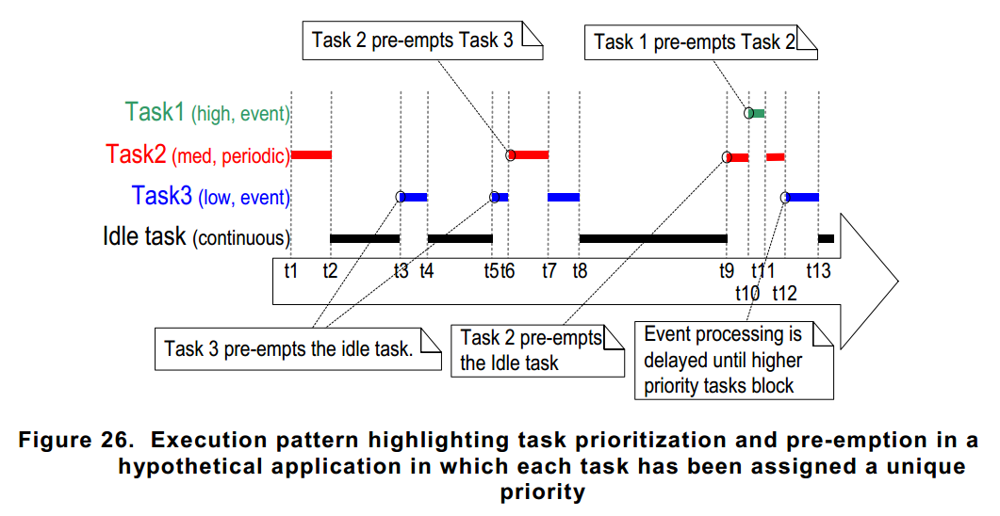
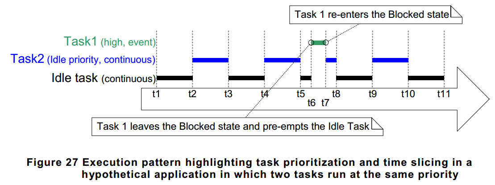
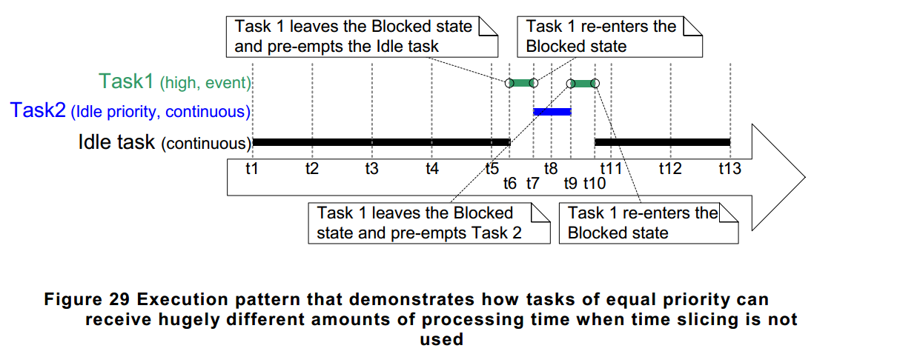

#

## FreeRTOS
### Task Scheduling Algorithms

Tasks that are in the Ready state are available to be selected by
the scheduler as the task to enter the Running state. The scheduler
will always choose the `highest priority Ready state task` to enter
the Running state.

Tasks can wait in the Blocked state `for an event` and are automatically
moved back to the Ready state when the event occurs.
For example:
<br> 1. when `a block time expires`, and are normally used to implement `periodic` or `timeout` behavior.
<br> 2. Synchronization events occur when a task or `interrupt service routine` sends information using
a task notification, `queue`, `event group`, or one of the many types of `semaphore`. They are
generally used to signal asynchronous activity, such as data arriving at a peripheral.

The algorithm can be changed using the `configUSE_PREEMPTION` and `configUSE_TIME_SLICING`
configuration constants. Both constants are defined in `FreeRTOSConfig.h`.

A third configuration constant, `configUSE_TICKLESS_IDLE` is described in Chapter 10,
`Low Power Support`.

+ Fixed Priority

Scheduling algorithms described as `Fixed Priority` do not change the priority
assigned to the tasks being scheduled, but also do not prevent the tasks
themselves from changing their own priority, or that of other tasks.

+ Pre-emptive

Pre-emptive scheduling algorithms will immediately `pre-empt` the Running
state task if a task that has a priority higher than the Running state task
enters the Ready state. Being pre-empted means being involuntarily (without
explicitly yielding or blocking) moved out of the Running state and into the
Ready state to allow a different task to enter the Running state.

+ Time Slicing

Time slicing is used to `share processing time` between tasks of equal priority,
even when the tasks do not explicitly yield or enter the Blocked state.
Scheduling algorithms described as using `Time Slicing` will select a new task
to enter the Running state at the end of each time slice if there are other
Ready state tasks that have the same priority as the Running task. A time
slice is equal to the time between two RTOS tick interrupts.

#### Tasks have a unique priority

configUSE_PREEMPTION 1
<br> configUSE_TIME_SLICING 1



#### 2 Tasks share a priority

configUSE_PREEMPTION 1
<br> configUSE_TIME_SLICING 1



#### Prioritized Pre-emptive Scheduling (without Time Slicing)

configUSE_PREEMPTION 1
<br> configUSE_TIME_SLICING 0



### ARM Cortex-M, Interrupts and FreeRTOS

<br> 1. vPortSVCHandler
<br> 2. xPortPendSVHandler
<br> 3. xPortSysTickHandler

## OS

+ [spinlock, mutex,semaphore](http://welkinchen.pixnet.net/blog/post/47071066-spinlock-%26-mutex-%26-semaphore-%E7%9A%84%E4%BD%9C%E7%94%A8%E5%92%8C%E5%8D%80%E5%88%A5)

```text
Mutex是一把鑰匙，一個人拿了就可進入一個房間，出來的時候把鑰匙交給隊列的第一個。一般的用法是用於串行化對critical
section代碼的訪問，保證這段代碼不會被並行的運行。
(A mutex is really a semaphore with value 1.)

Semaphore是一件可以容納N人的房間，如果人不滿就可以進去，如果人滿了，就要等待有人出來。對於N=1的情況，稱為binary
semaphore。一般的用法是，用於限制對於某一資源的同時訪問。

Binary semaphore與Mutex的差異：
在有的系統中Binary semaphore與Mutex是沒有差異的。在有的系統上，主要的差異是mutex一定要由獲得鎖的進程來釋放。而semaphore可以由其它進程釋放（這時的semaphore實際就是個原子的變量，大家可以加或減），因此semaphore可以用於進程間同步。
Semaphore的同步功能是所有系統都支持的，而Mutex能否由其他進程釋放則未定，因此建議mutex只用於保護critical
section。而semaphore則用於保護某變量，或者同步。

spin lock，這是一個內核態概念。 spin lock與semaphore的主要區別是spin lock是busy
waiting，而semaphore是sleep。對於可以sleep的進程來說，busy
waiting當然沒有意義。對於單CPU的系統，busy
waiting當然更沒意義（沒有CPU可以釋放鎖）。因此，只有多CPU的內核態非進程空間，才會用到spin lock。
Linux kernel的spin
lock在非SMP的情況下，只是關irq，沒有別的操作，用於確保該段程序的運行不會被打斷。其實也就是類似mutex的作用，串行化對critical
section的訪問。但是mutex不能保護中斷的打斷，也不能在中斷處理程序中被調用。而spin
lock也一般沒有必要用於可以sleep的進程空間。
```

+ [Mutexes VS Semaphores大揭秘](http://swem.logdown.com/posts/177651-mutexes-and-semaphores-demystified)

```text
Mutex 與 Semaphore 都是用在保護 critical section，確保多個 process
平行運作並存取資源時，執行結果不會因為執行程序的時間先後的影響而導致錯誤。
Mutex(Mutual Exclusion) 與 Semaphore 的差別在於:

process 使用 mutex 時，process 的運作是持有 Mutex，執行critical section 來存取資源，然後釋放 Mutex.
Mutex 就像是資源的一把鎖。
process 使用 semaphore 時，process 總是發出信號(signal)，或者總是接收信號(wait)，同一個 process
不會先後進行 signal 與 wait。也就是說，process 要嘛當 producer，要嘛當
consumer，不能兩者都是。Semaphore 是為了保護 process 的執行同步性。
Mutex 與 Semaphore 要解決的是不同的問題。了解這個部份後，就可以來區分 mutex 與 binary
semaphore。mutex 確保數個 process 在一個時間點上，只能有一個 process 存取單項資源，而 semaphore
則是讓數個 producer 與 數個 consumer 在訊號上進行合作。

另一個 mutex 與 binary semaphore 的差異在於，使用 mutex 會導致 priority inversion。也因此 mutex
中多半採用了一些機制來防止 Priority Inversion。Priority Inversion 是基於 process 持有 mutex
的概念，使得數個不同 priority 的 process ，在等待資源時透過 mutex 傳遞 priority，避免 priority
inversion 發生。

註：Mutex與Semaphore在很多書、文章中都有很多不同的解釋。我認為這篇文章談的是最嚴格定義的 Semaphore
(Dijkstra 所提出)，因此兩者有相當不同的區分。而後衍生出的 semaphore ，則包含了 counting semaphore 與
binary semaphore，也才能夠用於保護資源，或是處理 multiple identical resources 的問題。
```

+ Priority inversion

```text
http://blog.linux.org.tw/~jserv/archives/001299.html
http://wen00072.github.io/blog/2014/03/05/note-priority-inversion-on-mars/

Bounded priority inversion
高優先權的process/thread等待進入critical section，該critical
section目前由低優先權的process/thread佔用中。因此只要低優先權的process/thread離開該critical
section後高優先權的process/thread便可繼續執行

Unbounded priority inversion
高優先權的process/thread等待進入critical section，該critical
section目前由低優先權的process/thread佔用中
不幸的是，當低優先權process/thread還在critical
section執行的時候，被切換到中優先權的process/thread由於高優先權的process/thread被block，而低優先權的process/thread一定會被中優先權的process/thread搶走執行權。最壞的狀況就是之後就只剩中優先權的process/thread被執行

解法？
Priority inheritance
當高優先權的process/thread要進入critical
section發現該section以被低優先權的process/thread佔用時，系統暫時將該低優先權的process/thread調整到高優先權直到該低優先權的process/thread離開critical
section
看來可以解Unbounded priority inversion，bounded priority inversion應該還是本質無法解掉？
```
